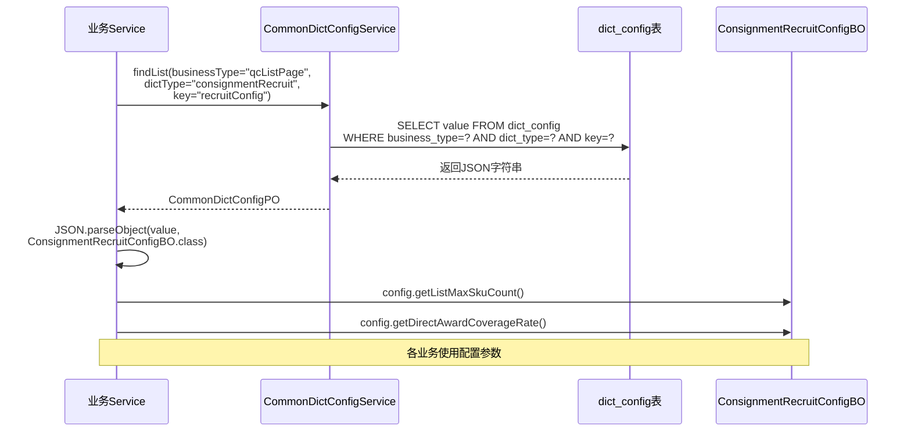

# 自营转寄卖 - 动态配置设计

## 一、设计思路

所有动态可调参数通过 `CommonDictConfig`（公共字典配置）统一管理，**只用一个配置条目**，以 JSON 格式存储，方便维护和扩展。

### 1.1 使用方式

#### 配置查询时序图



```java
// CommonDictConfig查询条件
CommonDictConfigBO queryBo = new CommonDictConfigBO();
queryBo.setBusinessType("qcListPage");
queryBo.setDictType("consignmentRecruit");
queryBo.setKey("recruitConfig");

// 查询并解析
CommonDictConfigPO configPO = commonDictConfigService.findList(queryBo).get(0);
ConsignmentRecruitConfigBO config = JSON.parseObject(configPO.getValue(), ConsignmentRecruitConfigBO.class);

// 使用配置
Integer maxSkuCount = config.getListMaxSkuCount();
BigDecimal directAwardRate = config.getDirectAwardCoverageRate();
```

### 1.2 配置层级

```
CommonDictConfig
├── business_type: qcListPage
├── dict_type: consignmentRecruit
├── key: recruitConfig
└── value: JSON字符串（详见下文）
```

---

## 二、JSON Schema 设计

### 2.1 完整JSON结构

```json
{
  "listMaxSkuCount": 200,
  "listMinSkuCount": 11,
  "roundMaxPublishCount": 20,
  "listMaxApplyCount": 5,
  "supplierMaxRecruitSlot": 5,
  "sameSourceWeightRate": 0.10,
  "directAwardCoverageRate": 0.80,
  "ceCreateTimeoutDays": 3,
  "awardWaitDays": 14,
  "recycleCoverageThreshold": 0.80,
  "recycleConsecutiveMonthsWarn": 2,
  "recycleConsecutiveMonthsRecycle": 3,
  "publishDayOfWeek": 3,
  "publishVisibleTime": "10:00:00",
  "applyStartTime": "14:00:00",
  "applyEndTime": "21:00:00",
  "groupSkuOrderField": "create_time",
  "groupSkuOrderAsc": true,
  "saleDaysForGroup": 90,
  "minSaleQtyForGroup": 1,
  "replenishRemindDays": 21
}
```

### 2.2 配置项说明

| 配置项 | 类型 | 默认值 | 说明 |
|--------|:----:|:------:|------|
| `listMaxSkuCount` | int | 200 | 单张清单最大SKU数，超出自动拆单 |
| `listMinSkuCount` | int | 11 | 单张清单最小SKU数（必须>10） |
| `roundMaxPublishCount` | int | 20 | 每轮最多发布的清单数 |
| `listMaxApplyCount` | int | 5 | 每张清单最多允许的寄卖商申请数（竞争池容量） |
| `supplierMaxRecruitSlot` | int | 5 | 每个寄卖商最多可加入的招募清单数 |
| `sameSourceWeightRate` | decimal(0.00) | 0.10 | 同源扶持加权比例（10%） |
| `directAwardCoverageRate` | decimal(0.00) | 0.80 | 覆盖率>=此值直接获胜 |
| `ceCreateTimeoutDays` | int | 3 | 加入招募车后开CE单超时天数（自然日） |
| `awardWaitDays` | int | 14 | 首个CE质检通过后的最长等待天数 |
| `recycleCoverageThreshold` | decimal(0.00) | 0.80 | 回收覆盖率阈值 |
| `recycleConsecutiveMonthsWarn` | int | 2 | 连续N月低于阈值触发预警 |
| `recycleConsecutiveMonthsRecycle` | int | 3 | 连续N月低于阈值回收清单 |
| `publishDayOfWeek` | int | 3 | 发布日（1=周一...7=周日，3=周三） |
| `publishVisibleTime` | string | "10:00:00" | 清单可见时间 |
| `applyStartTime` | string | "14:00:00" | 开放申请时间（可抢单） |
| `applyEndTime` | string | "21:00:00" | 申请结束时间 |
| `groupSkuOrderField` | string | "create_time" | 组单排序字段（按SKU创建时间） |
| `groupSkuOrderAsc` | boolean | true | 是否正序（优先组生成时间早的） |
| `saleDaysForGroup` | int | 90 | 组单筛选的近N天销量条件 |
| `minSaleQtyForGroup` | int | 1 | 组单筛选的最小销量 |
| `replenishRemindDays` | int | 21 | 补货提醒查询天数 |

### 2.3 Java BO 类

```java
package com.ux168.pa.service.scms.biz.service.consignment.recruit.bo;

import lombok.Data;
import java.math.BigDecimal;

/**
 * 自营转寄卖动态配置BO
 */
@Data
public class ConsignmentRecruitConfigBO {
    /** 单清单最大SKU数 */
    private Integer listMaxSkuCount = 200;
    /** 单清单最小SKU数 */
    private Integer listMinSkuCount = 11;
    /** 每轮最多发布清单数 */
    private Integer roundMaxPublishCount = 20;
    /** 每张清单最多寄卖商数 */
    private Integer listMaxApplyCount = 5;
    /** 每寄卖商最多招募位 */
    private Integer supplierMaxRecruitSlot = 5;
    /** 同源扶持加权比例 */
    private BigDecimal sameSourceWeightRate = new BigDecimal("0.10");
    /** 直接获胜覆盖率阈值 */
    private BigDecimal directAwardCoverageRate = new BigDecimal("0.80");
    /** 开CE超时天数 */
    private Integer ceCreateTimeoutDays = 3;
    /** 评选最长等待天数 */
    private Integer awardWaitDays = 14;
    /** 回收覆盖率阈值 */
    private BigDecimal recycleCoverageThreshold = new BigDecimal("0.80");
    /** 连续N月低于阈值预警 */
    private Integer recycleConsecutiveMonthsWarn = 2;
    /** 连续N月低于阈值回收 */
    private Integer recycleConsecutiveMonthsRecycle = 3;
    /** 发布日（1-7） */
    private Integer publishDayOfWeek = 3;
    /** 清单可见时间 */
    private String publishVisibleTime = "10:00:00";
    /** 开放申请时间 */
    private String applyStartTime = "14:00:00";
    /** 申请结束时间 */
    private String applyEndTime = "21:00:00";
    /** 组单排序字段 */
    private String groupSkuOrderField = "create_time";
    /** 组单排序方向 */
    private Boolean groupSkuOrderAsc = true;
    /** 组单筛选销量天数 */
    private Integer saleDaysForGroup = 90;
    /** 组单筛选最小销量 */
    private Integer minSaleQtyForGroup = 1;
    /** 补货提醒查询天数 */
    private Integer replenishRemindDays = 21;
}
```

---

## 三、配置管理服务

### 3.1 接口定义

```java
package com.ux168.pa.service.scms.biz.service.consignment.recruit;

/**
 * 自营转寄卖配置服务
 */
public interface ConsignmentRecruitConfigService {
    /**
     * 获取招募配置（带缓存）
     */
    ConsignmentRecruitConfigBO getConfig();

    /**
     * 刷新配置缓存
     */
    void refreshConfig();
}
```

### 3.2 使用示例

```java
// 获取配置
ConsignmentRecruitConfigBO config = configService.getConfig();

// 判断是否超过最大SKU数
if (skuCount > config.getListMaxSkuCount()) {
    // 需要拆单
}

// 判断是否达到直接获胜条件
if (finalCoverageRate.compareTo(config.getDirectAwardCoverageRate()) >= 0) {
    // 直接获胜
}
```

---

## 四、配置初始化SQL

```sql
-- 初始化一条默认配置
INSERT INTO `common_dict_config` (
    `business_type`, `dict_type`, `key`, `value`, 
    `description`, `enabled`, `is_deleted`, `version`
) VALUES (
        'qcListPage',
        'consignmentRecruit',
        'recruitConfig',
    '{
        "listMaxSkuCount": 200,
        "listMinSkuCount": 11,
        "roundMaxPublishCount": 20,
        "listMaxApplyCount": 5,
        "supplierMaxRecruitSlot": 5,
        "sameSourceWeightRate": 0.10,
        "directAwardCoverageRate": 0.80,
        "ceCreateTimeoutDays": 3,
        "awardWaitDays": 14,
        "recycleCoverageThreshold": 0.80,
        "recycleConsecutiveMonthsWarn": 2,
        "recycleConsecutiveMonthsRecycle": 3,
        "publishDayOfWeek": 3,
        "publishVisibleTime": "10:00:00",
        "applyStartTime": "14:00:00",
        "applyEndTime": "21:00:00",
        "groupSkuOrderField": "create_time",
        "groupSkuOrderAsc": true,
        "saleDaysForGroup": 90,
        "minSaleQtyForGroup": 1,
        "replenishRemindDays": 21
    }',
    '自营转寄卖业务动态配置',
    1, 0, 1
);
```
