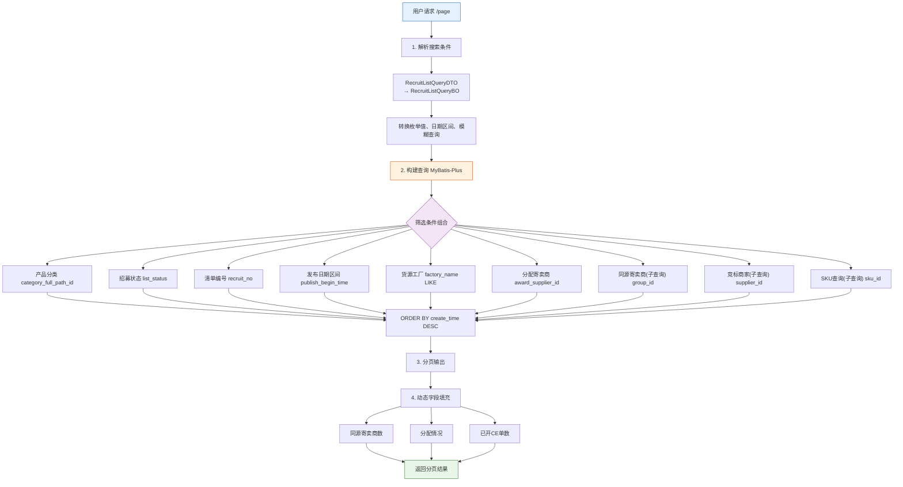

# 4-1 招募清单查询与导出

## 一、概述

| 项目 | 说明 |
|------|------|
| **PRD章节** | 2.1.3.1 招募清单查询 |
| **面向用户** | 运营后台管理人员 (PA业务管理系统→供应链管理→寄卖清单竞拍→清单查询) |
| **功能** | 多维度搜索+列表展示+批量导出 |

---

## 二、数据源

### 2.1 搜索条件来源

| 搜索字段 | 来源表 | 字段 | 说明 |
|---------|--------|------|------|
| 产品分类 | `recruit_list` | `category_full_path_id` | 一级+二级中文分类 |
| 招募状态 | `recruit_list` | `list_status` | 枚举：10/20/25/30/50/60/100 |
| 预招募清单 | `recruit_list` | `recruit_no` | 多选 |
| 发布日期 | `recruit_list` | `publish_begin_time` | 区间查询 |
| 货源工厂 | `recruit_list` | `factory_name` | 模糊搜索，多选 |
| 分配寄卖商 | `recruit_list` | `award_supplier_id` | 关联供应商表 |
| 同源寄卖商 | `recruit_apply` | `group_id` | 集团级别查询 |
| 参与竞标商家 | `recruit_apply` | `supplier_id` | 多选 |
| SKU查询 | `recruit_list_sku` | `sku_id` | 最多100个 |

### 2.2 列表字段来源

| 列表字段 | 来源 | 计算逻辑 |
|---------|------|----------|
| 发布周期 | `recruit_publish.publish_round` | 前端展示为 `W{round}(mm/dd-mm/dd)星期三` |
| 预招募清单编号 | `recruit_list.recruit_no` | SC+年月日+4位递增 |
| 清单类型 | 常量 | 固定值"自营转寄卖" |
| 货源工厂 | `recruit_list.factory_name` | 直接读取 |
| 产品分类 | 关联分类表 | 根据 `category_full_path_id` |
| 产品线 | 关联分类表 | 末级分类 |
| 招募SKU数 | `recruit_list.sku_count` | 直接读取 |
| 预估首次投入成本 | `recruit_list.estimated_cost` | 组单时快照 |
| 预估月销总件数 | `recruit_list.estimated_month_sale_qty` | 组单时快照 |
| 预估月销售额 | `recruit_list.estimated_month_sale_amount` | 组单时快照 |
| 平均MOQ | `recruit_list.avg_moq` | 组单时快照 |
| 同源寄卖商数 | `recruit_apply` | **难点**：去重统计 `group_id` 不为空且 `apply_status` 非作废的记录数 |
| 审核人 | `recruit_list.audit_by` | 脚本自动审核记录 |
| 分配情况 | `recruit_apply` | **动态统计**：无人申请时显示"暂无供应商申请"，有申请时显示"X家" |
| 开始发布时间 | `recruit_list.publish_begin_time` | 直接读取 |
| 结束发布时间 | `recruit_list.publish_end_time` | 直接读取 |
| 清单分配时间 | `recruit_list.award_time` | 分配完成前为空 |
| 招募状态 | `recruit_list.list_status` | 枚举值转中文 |
| 已开CE单数 | `recruit_apply` | **动态统计**：`ce_bill_no IS NOT NULL` 且 `apply_status != 90/100` 的记录数 |

---

## 三、搜索流程

### 流程图



### 文本流程说明

```
用户请求 /page
    │
    ├─ 1. 解析搜索条件 ─────────────────────────────────────
    │    RecruitListQueryDTO → RecruitListQueryBO
    │    转换枚举值、日期区间、模糊查询等
    │
    ├─ 2. 构建查询（MyBatis-Plus） ─────────────────────────
    │    SELECT * FROM recruit_list rl
    │    [LEFT JOIN recruit_apply ra ON rl.id = ra.recruit_id]  // 按需
    │    WHERE 1=1
    │      AND (产品分类筛选)  // rl.category_full_path_id IN (...)
    │      AND (招募状态)     // rl.list_status IN (...)
    │      AND (清单编号)     // rl.recruit_no IN (...)
    │      AND (发布日期)     // rl.publish_begin_time BETWEEN ? AND ?
    │      AND (货源工厂)     // rl.factory_name LIKE ?
    │      AND (分配寄卖商)   // rl.award_supplier_id IN (...)
    │      AND (同源寄卖商)   // 子查询: ra.group_id = ?
    │      AND (竞标商家)     // 子查询: ra.supplier_id IN (...)
    │      AND (SKU查询)     // 子查询: rls.sku_id IN (...)
    │    ORDER BY rl.create_time DESC
    │
    ├─ 3. 分页 ──────────────────────────────────────────────
    │    PageHelper / MyBatis-Plus Page
    │
    └─ 4. 动态字段填充 ─────────────────────────────────────
       对每张清单，计算同源寄卖商数、分配情况、已开CE单数
       （这些无法用单表查询直接获得，需二次查询或子查询）
```

---

## 四、状态走向

列表展示的招募状态与 `recruit_list.list_status` 映射：

| 列表展示 | 枚举值 | 说明 |
|---------|:------:|------|
| 待发布 | 10 | 未到发布时间的清单 |
| 招募中 | 20 | 正在招募，有申请 |
| 已抢完 | 25 | 5家满员 |
| 无人申请已回收 | 30 | 发布后无人申请 |
| 分配中 | 50 | 评选完成已分配 |
| 清单完成 | 60 | 正式运营 |
| 作废 | 100 | 已作废 |

---

## 五、表数据处理

| 操作 | 表 | 说明 |
|------|-----|------|
| SELECT | `recruit_list` | 主查询表，关联分类表 |
| SELECT（关联） | `recruit_apply` | 同源寄卖商数、竞标商家、CE单数 |
| SELECT（关联） | `recruit_list_sku` | SKU查询条件 |
| SELECT（关联） | `recruit_publish` | 发布周期展示（发布轮次） |

---

## 六、难点与解决点

| 难点 | 解决 |
|------|------|
| **同源寄卖商数**是动态统计值，非表字段 | 改为子查询或冗余统计：`SELECT COUNT(DISTINCT group_id) FROM recruit_apply WHERE recruit_id = ? AND group_id IS NOT NULL AND apply_status NOT IN (90,100)` |
| **已开CE单数**也是动态值 | 同上，使用子查询：`SELECT COUNT(*) FROM recruit_apply WHERE recruit_id = ? AND ce_bill_no IS NOT NULL` |
| **分配情况**条件分支显示 | Service层判断：`applyCount > 0 ? "X家" : "暂无供应商申请"` |
| **导出时数据量大** | 分段查询，使用流式导出（SXSSFWorkbook） |
| **多条件组合查询性能** | 关键字段建立联合索引：`idx_recruit_factory_cat_status`、`idx_recruit_status`、`idx_recruit_publish_time` |
| **批量导出时动态字段重新计算** | 在导出Service中逐条补充动态字段，避免分页查询遗漏 |

---

## 七、CRUD API 映射

| 数据操作 | CRUD ServiceApi | 说明 |
|---------|----------------|------|
| 清单主表 CRUD | `ConsignmentRecruitListServiceApi` | 分页查询、列表查询、ID查询、导出数据 |
| 申请表统计 | `ConsignmentRecruitApplyServiceApi` | 统计竞争池人数、CE单数 |
| SKU明细查询 | `ConsignmentRecruitListSkuServiceApi` | SKU编号条件筛选 |
| 发布记录 | `ConsignmentRecruitPublishServiceApi` | 发布周期展示 |

> 详细 API 方法签名参见 [8-CRUD数据操作层技术方案.md](../8-CRUD数据操作层技术方案.md#十一开放-api-接口serviceapi) 第11章
