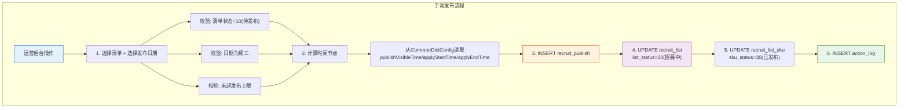

# 4-3 清单发布管理

## 一、概述

| 项目 | 说明 |
|------|------|
| **PRD章节** | 2.1.1.1 清单脚本 - 发布脚本 |
| **面向用户** | 运营后台管理人员 + 系统定时任务 |
| **功能** | 手动发布清单（后台操作）+ 自动发布清单（定时任务触发） |

---

## 二、数据源

### 2.1 发布涉及的字段

| 操作 | 表 | 字段 | 说明 |
|------|-----|------|------|
| **读取** | `recruit_list` | `id, recruit_no, sku_count, create_time` | 待发布清单，`list_status=10` |
| **读取** | `CommonDictConfig` | `publishVisibleTime`(10:00:00) | 可见时间 |
| **读取** | `CommonDictConfig` | `applyStartTime`(14:00:00) | 开放申请时间 |
| **读取** | `CommonDictConfig` | `applyEndTime`(21:00:00) | 申请截止时间 |
| **读取** | `CommonDictConfig` | `roundMaxPublishCount`(20) | 每轮最大发布数 |
| **计算** | 系统时间 | `publish_round` | ISO周数 |
| **计算** | 系统时间 | `publish_end_time` | 当天23:59:59 |
| **写入** | `recruit_publish` | INSERT | 创建发布记录 |
| **写入** | `recruit_list` | UPDATE | 更新清单状态+时间 |
| **写入** | `recruit_list_sku` | UPDATE | SKU标记为已发布 |
| **写入** | `action_log` | INSERT | 操作日志 |

### 2.2 发布记录 INSERT 字段对照

```
recruit_publish:
  recruit_id       = recruit_list.id
  recruit_no       = recruit_list.recruit_no
  publish_round    = ISO周数（如21）
  publish_status   = 20(招募中)
  publish_begin_time = 当天 publishVisibleTime
  apply_begin_time   = 当天 applyStartTime
  apply_end_time     = 当天 applyEndTime
  publish_end_time   = 当天 23:59:59
  create_by         = 'system' / 操作用户
```

### 2.3 清单 UPDATE 字段对照

```
recruit_list:
  list_status       = 20(招募中)
  publish_begin_time = 当天 publishVisibleTime
  apply_begin_time   = 当天 applyStartTime
  apply_end_time     = 当天 applyEndTime
  publish_end_time   = 当天 23:59:59
  publish_by         = '系统' / 操作用户
```

### 2.4 SKU UPDATE

```
recruit_list_sku:
  sku_status = 30(已发布)
  WHERE recruit_id = ? AND sku_status = 20(已组单)
```

---

## 三、发布流程

### 流程图



### 3.1 手动发布（文本说明）

```
运营后台操作
    │
    ├─ 1. 选择清单 + 选择发布日期 ─────────────────────────
    │    系统校验：
    │    - 清单状态必须为 10(待发布)
    │    - 选择的日期必须为周三（publishDayOfWeek）
    │    - 未超过 roundMaxPublishCount 限制
    │
    ├─ 2. 计算时间节点 ────────────────────────────────────
    │    同自动发布配置（从 CommonDictConfig 读取时间）
    │    但如果手动指定了发布时间，则使用指定时间
    │
    ├─ 3. INSERT recruit_publish ──────────────────────────
    │    同上数据源对照表
    │
    ├─ 4. UPDATE recruit_list ─────────────────────────────
    │    同上数据源对照表
    │
    ├─ 5. UPDATE recruit_list_sku ─────────────────────────
    │    sku_status = 30(已发布)
    │
    └─ 6. INSERT action_log ──────────────────────────────
        action = PUBLISH, operator = 当前用户
```

### 3.2 自动发布（AutoPublishJob）

详见 `6-定时任务/6-2-自动发布任务.md`

自动发布的核心流程与手动发布一致，区别在于：
- 自动发布按 `create_time` 升序批量取20张
- 自动发布在周三10:00执行
- 自动发布的 operator = "系统"

---

## 四、状态走向

```
recruit_list:
  10(待发布) ─── 手动/自动发布 ───→ 20(招募中)

recruit_list_sku:
  20(已组单) ─── 发布 ───→ 30(已发布)

recruit_publish:
  (INSERT) ───→ publish_status = 20(招募中)
```

---

## 五、表数据处理

| 操作 | 表 | SQL/说明 |
|------|-----|----------|
| SELECT | `recruit_list` | `WHERE list_status=10 ORDER BY create_time LIMIT 20` |
| SELECT | `recruit_list` | `WHERE id=? AND list_status=10`（手动发布校验） |
| INSERT | `recruit_publish` | 插入发布记录 |
| UPDATE | `recruit_list` | `SET list_status=20, publish_begin_time=?, ... WHERE id=?` |
| UPDATE | `recruit_list_sku` | `SET sku_status=30 WHERE recruit_id=? AND sku_status=20` |
| INSERT | `action_log` | action='PUBLISH' |

**事务要求**：以上 INSERT + UPDATE 操作必须在同一个事务中执行。

---

## 六、难点与解决点

| 难点 | 解决 |
|------|------|
| **手动发布时并发重复发布** | 使用 `list_status=10` 作为乐观锁条件：`UPDATE recruit_list SET list_status=20 WHERE id=? AND list_status=10`，影响行数为0时说明已被发布 |
| **publish_round 唯一键冲突** | `uniq_publish_recruit_round(recruit_id, publish_round)` 自动保障，插入时捕获 DuplicateKeyException 处理 |
| **周三校验** | 使用 `DayOfWeek.WEDNESDAY` 或配置的 `publishDayOfWeek` 校验，避免硬编码 |
| **手动发布超过20张限制** | 即使手动发布也要遵守上限限制，否则运营可以绕过规则 |

---

## 七、CRUD API 映射

| 数据操作 | CRUD ServiceApi | 说明 |
|---------|----------------|------|
| 清单主表更新 | `ConsignmentRecruitListServiceApi` | 更新清单状态、发布时间字段 |
| 发布记录 | `ConsignmentRecruitPublishServiceApi` | 创建发布记录 |
| SKU明细更新 | `ConsignmentRecruitListSkuServiceApi` | SKU标记为已发布 |
| 操作日志 | `ConsignmentActionLogServiceApi` | 记录发布日志 |

> 详细 API 方法签名参见 [8-CRUD数据操作层技术方案.md](../8-CRUD数据操作层技术方案.md#十一开放-api-接口serviceapi) 第11章
