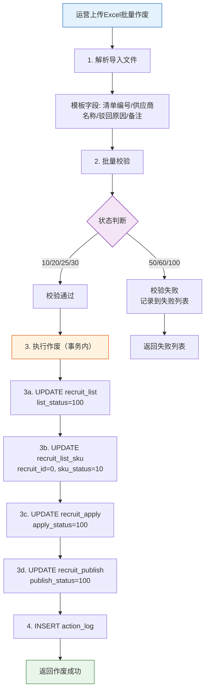

# 4-4 清单作废管理

## 一、概述

| 项目 | 说明 |
|------|------|
| **PRD章节** | 2.1.3.1 招募清单查询 - 批量作废 |
| **面向用户** | 运营后台管理人员 |
| **功能** | 批量作废清单 + SKU释放回池 + 作废原因记录 |

---

## 二、数据源

| 操作 | 表 | 字段 | 说明 |
|------|-----|------|------|
| **读取** | — | 批量导入的Excel/模板数据 | 清单编号、供应商名称、驳回原因、备注 |
| **更新** | `recruit_list` | `list_status=100, cancel_type, cancel_time, cancel_by, cancel_reason` | 清单作废 |
| **更新** | `recruit_list_sku` | `recruit_id=0, sku_status=10(待组单)` | SKU释放回招募池 |
| **更新** | `recruit_apply` | `apply_status=100, cancel_type, cancel_reason` | 关联申请作废 |
| **更新** | `recruit_publish` | `publish_status=100` | 关联发布作废 |
| **插入** | `action_log` | action=CANCEL_LIST | 操作日志 |

---

## 三、作废流程

### 流程图



### 文本流程说明

```
运营上传Excel批量作废
    │
    ├─ 1. 解析导入文件 ────────────────────────────────────
    │    模板字段：清单编号、供应商名称、驳回原因(枚举)、备注
    │    驳回原因枚举：供应商原因、货源原因
    │    校验：清单编号是否存在、清单当前状态是否可作废
    │
    ├─ 2. 批量校验 ────────────────────────────────────────
    │    可作废的状态：10(待发布) / 20(招募中) / 25(已抢完) / 30(无人申请已回收)
    │    不可作废的状态：50(分配中) / 60(清单完成) / 100(已作废)
    │    校验失败项记录到失败列表，整体不中断
    │
    ├─ 3. 执行作废（事务内） ──────────────────────────────
    │    ┌──────────────────────────────────────────────────┐
    │    │  3a. UPDATE recruit_list                       │
    │    │      list_status = 100(作废)                   │
    │    │      cancel_type = 'manual'                    │
    │    │      cancel_time = 当前时间                    │
    │    │      cancel_by = 当前用户名                    │
    │    │      cancel_reason = 导入的驳回原因+备注       │
    │    ├──────────────────────────────────────────────────┤
    │    │  3b. UPDATE recruit_list_sku                   │
    │    │      recruit_id = 0   (释放回池)               │
    │    │      sku_status = 10(待组单)                   │
    │    │      WHERE recruit_id = 作废清单ID             │
    │    ├──────────────────────────────────────────────────┤
    │    │  3c. UPDATE recruit_apply                      │
    │    │      apply_status = 100(放弃/作废)             │
    │    │      cancel_type = 'list_cancel'               │
    │    │      cancel_reason = '清单已作废'              │
    │    │      WHERE recruit_id = 作废清单ID             │
    │    │      AND apply_status NOT IN (90,100)          │
    │    ├──────────────────────────────────────────────────┤
    │    │  3d. UPDATE recruit_publish                    │
    │    │      publish_status = 100(作废)                │
    │    │      WHERE recruit_id = 作废清单ID             │
    │    └──────────────────────────────────────────────────┘
    │
    └─ 4. 记录操作日志 ────────────────────────────────────
       每条作废记录一条 action_log
       action = CANCEL_LIST
       content = 作废原因
```

---

## 四、状态走向

```
recruit_list:
  10(待发布) ──┐
  20(招募中) ──┤
  25(已抢完) ──┼── 批量作废 ──→ 100(作废)
  30(无人申请)─┘

recruit_apply:
  ANY(非90/100) ── 清单作废 ──→ 100(放弃/作废)

recruit_publish:
  20(招募中) / 25(已抢完) / 30(无人申请) ──→ 100(作废)

recruit_list_sku:
  20(已组单) / 30(已发布) ── 清单作废 ──→ 10(待组单) [recruit_id=0]
```

---

## 五、表数据处理

| 操作 | 表 | SQL/说明 |
|------|-----|----------|
| UPDATE | `recruit_list` | `SET list_status=100, cancel_type='manual', cancel_time=NOW(), cancel_by=?, cancel_reason=? WHERE id=? AND list_status NOT IN (50,60,100)` |
| UPDATE | `recruit_list_sku` | `SET recruit_id=0, sku_status=10 WHERE recruit_id=?` |
| UPDATE | `recruit_apply` | `SET apply_status=100, cancel_type='list_cancel' WHERE recruit_id=? AND apply_status NOT IN (90,100)` |
| UPDATE | `recruit_publish` | `SET publish_status=100 WHERE recruit_id=? AND publish_status NOT IN (100)` |
| INSERT | `action_log` | 每条作废操作记录一条日志 |

---

## 六、难点与解决点

| 难点 | 解决 |
|------|------|
| **批量作废的事务一致性** | 4个表的UPDATE必须在同一事务中，任意失败整体回滚，避免SKU丢失或状态不一致 |
| **已分配的清单不可作废** | Service层校验 `list_status IN (50,60)` 时直接拒绝，返回错误提示 |
| **SKU回池后状态冲突** | 作废前SKU可能是 `30(已发布)`，回池后重置为 `10(待组单)`，确保下次组单可正常扫描到 |
| **并发作废同一清单** | 使用乐观锁：`UPDATE recruit_list SET list_status=100 WHERE id=? AND list_status NOT IN (50,60,100)`，影响行数=0时说明已被其他操作变更 |
| **导入失败的处理** | 批量导入使用逐条处理模式，失败项记录到失败列表，成功项继续执行，最终返回 "成功X条，失败Y条" |

---

## 七、CRUD API 映射

| 数据操作 | CRUD ServiceApi | 说明 |
|---------|----------------|------|
| 清单主表作废 | `ConsignmentRecruitListServiceApi` | 更新 list_status=100, cancel 字段 |
| SKU释放回池 | `ConsignmentRecruitListSkuServiceApi` | SKU回到 recruit_id=0, sku_status=10 |
| 申请状态作废 | `ConsignmentRecruitApplyServiceApi` | 关联申请作废 |
| 发布状态作废 | `ConsignmentRecruitPublishServiceApi` | 关联发布作废 |
| 操作日志 | `ConsignmentActionLogServiceApi` | 记录作废日志 |

> 详细 API 方法签名参见 [8-CRUD数据操作层技术方案.md](../8-CRUD数据操作层技术方案.md#十一开放-api-接口serviceapi) 第11章
