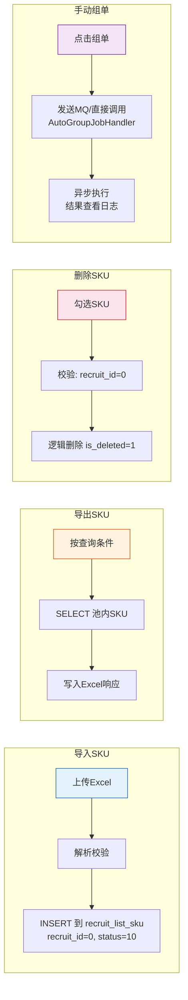

# 4-5 招募池管理

## 一、概述

| 项目 | 说明 |
|------|------|
| **PRD章节** | 2.1.2.1 招募池 |
| **面向用户** | 运营后台管理人员 (PA业务管理系统→产品开发管理→产品目录管理→预采购清单明细→自营转寄卖) |
| **功能** | SKU导入/导出/删除 + 手动触发组单 + 池状态管理 |

---

## 二、数据源

### 2.1 数据来源

招募池使用 `recruit_list_sku` 表承载，`recruit_id=0` 表示在池中。

| 操作 | 表 | 条件 | 说明 |
|------|-----|------|------|
| **查询** | `recruit_list_sku` | `recruit_id=0 AND sku_status=10(待组单)` | 池内SKU列表 |
| **导入** | `recruit_list_sku` | INSERT | 导入新的待组单SKU |
| **删除** | `recruit_list_sku` | 逻辑删除 `is_deleted=1` | 删除池内SKU |
| **导出** | `recruit_list_sku` | SELECT | 导出池内SKU |
| **手动组单** | 调用 AutoGroupJob | 触发 | 立即执行组单 |

### 2.2 搜索条件

| 字段 | 来源 | 说明 |
|------|------|------|
| SKUID | `recruit_list_sku.sku_id` | 多选 |
| 货源工厂 | 关联表 | 模糊查询 |
| 产品线 | 关联分类表 | 模糊查询 |
| 导入日期 | `recruit_list_sku.import_time` | 区间查询 |

### 2.3 列表字段

| 字段 | 来源 | 说明 |
|------|------|------|
| SKUID | `recruit_list_sku.sku_id` | 直接读取 |
| 中文描述 | `recruit_list_sku.sku_name` | 直接读取 |
| 货源链接 | `recruit_list_sku.purchase_url` | 可点击跳转 |
| 货源工厂 | `recruit_list_sku.factory_name` | 直接读取 |
| 产品分类 | 关联分类表 | 一级+二级 |
| 产品线 | 关联分类表 | 末级 |
| MOQ | `recruit_list_sku.moq` | 最小起订量 |
| 采购价 | `recruit_list_sku.cost_price` | Cost价格 |
| 导入人 | `recruit_list_sku.import_user` | 直接读取 |
| 导入时间 | `recruit_list_sku.import_time` | 直接读取 |

---

## 三、功能流程

### 流程图



### 3.1 导入SKU（文本说明）

```
上传Excel文件
    │
    ├─ 1. 下载模板 → 填写SKUID → 上传
    ├─ 2. 解析Excel ───────────────────────────────────────
    │    逐行解析，校验：
    │    - SKU是否为自营SKUID（非寄卖）
    │    - SKU状态是否为 "寄卖转自营" 且为APO状态
    │    - 货源工厂名称是否与系统绑定一致
    │    - 不能重复导入（已存在于池中则跳过）
    │
    ├─ 3. 处理结果 ────────────────────────────────────────
    │    - 全部成功：INSERT recruit_list_sku, import_batch_no
    │    - 部分重复：成功X条，重复Y条自动跳过
    │    - 部分失败：成功X条，失败Y条（列出失败原因）
    │
    └─ 4. 返回导入结果 ────────────────────────────────────
        成功提示 + 失败列表
```

### 3.2 导出SKU

```
请求导出
    │
    ├─ 1. 按当前查询条件导出 ──────────────────────────────
    │    SELECT * FROM recruit_list_sku
    │    WHERE recruit_id=0 AND sku_status=10
    │    [加上搜索条件过滤]
    │
    └─ 2. 写入Excel并响应文件流 ─────────────────────────
       使用 EasyExcel / SXSSFWorkbook 流式导出
```

### 3.3 删除SKU

```
勾选SKU → 删除
    │
    ├─ 校验：只能删除 recruit_id=0 的池内SKU
    │
    └─ 逻辑删除：UPDATE recruit_list_sku SET is_deleted=1 WHERE sku_id IN (...)
```

### 3.4 手动触发组单

```
运营点击"组单"按钮
    │
    ├─ 发送MQ消息或直接调用 AutoGroupJobHandler.execute()
    │
    └─ 返回"组单任务已触发"（异步执行，结果查看日志）
```

---

## 四、状态走向

```
recruit_list_sku.sku_status 在池中的状态：
  10(待组单) ── 组单 ──→ 20(已组单) [recruit_id > 0]
                                     │
                                     发布 ──→ 30(已发布)
                                     │
                                     作废 ──→ 10(待组单) [回到池中]
```

---

## 五、表数据处理

| 操作 | 表 | 说明 |
|------|-----|------|
| INSERT | `recruit_list_sku` | 导入新SKU，recruit_id=0, sku_status=10 |
| SELECT | `recruit_list_sku` | 池内查询、导出 |
| UPDATE | `recruit_list_sku` | 逻辑删除 `is_deleted=1` |

---

## 六、难点与解决点

| 难点 | 解决 |
|------|------|
| **SKU合法性校验**（自营/APO状态/货源工厂） | 导入时调用商品中心Feign接口验证每个SKU，缓存校验结果避免重复查询 |
| **重复导入判断** | 使用 `uniq_recruit_sku(recruit_id, sku_id, is_deleted)` 唯一键，recruit_id=0的情况下捕获 DuplicateKeyException |
| **大批量导入性能** | 使用批量INSERT（MyBatis-Plus saveBatch），每500条一批，事务分段 |
| **SKU在池中但在其他清单中** | 通过 `uniq_recruit_sku` 唯一键约束保障，同一SKU不能同时在两个清单 |
| **导入模板格式** | 固定模板：SKUID列，支持复制粘贴，文件格式为.xlsx |

---

## 七、CRUD API 映射

| 数据操作 | CRUD ServiceApi | 说明 |
|---------|----------------|------|
| SKU明细CRUD | `ConsignmentRecruitListSkuServiceApi` | 池内SKU查询、导入、删除、导出 |
| 操作日志 | `ConsignmentActionLogServiceApi` | 记录导入/删除/组单操作日志 |

> - 手动组单触发后调用 `ConsignmentRecruitListServiceApi.create` + `ConsignmentRecruitListSkuServiceApi.batchUpdate`
> - 详细 API 方法签名参见 [8-CRUD数据操作层技术方案.md](../8-CRUD数据操作层技术方案.md#十一开放-api-接口serviceapi) 第11章
