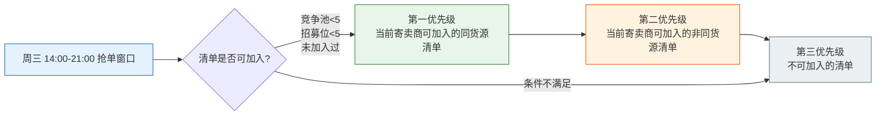

# 5-1 招募市场列表

## 一、概述

| 项目 | 说明 |
|------|------|
| **PRD章节** | 2.1.4.1 招募清单列表（招募市场） |
| **面向用户** | 寄卖商（供应商工作台→PA新品开发→招募市场→招募清单列表） |
| **功能** | 浏览可参与的招募清单、查看SKU明细、加入/撤回招募车 |

---

## 二、数据源

### 2.1 搜索条件

| 字段 | 来源 | 说明 |
|------|------|------|
| 招募时间 | `recruit_list.publish_begin_time` | 区间值 |
| 货源工厂 | `recruit_list.factory_name` | 模糊搜索，多选 |
| 产品线 | 关联分类表 | 末级分类，模糊搜索，多选 |
| 竞争池人数 | `recruit_apply` | 动态统计：`≤5/≤4/≤3/≤2/≤1` 过滤 |
| SKU查询 | `recruit_list_sku.sku_id` | 多选 |
| 价格区间 | `recruit_list.estimated_cost` | 清单总额区间 |
| 我的同货源 | `recruit_apply.group_id` | 仅显示当前寄卖商集团有同货源的清单 |

### 2.2 列表字段

| 字段 | 来源 | 说明 |
|------|------|------|
| 发布招募时间 | `recruit_list.publish_begin_time` | 直接读取 |
| 清单编号 | `recruit_list.recruit_no` | SC单号 |
| 货源工厂 | `recruit_list.factory_name` | 直接读取 |
| 产品分类 | 关联分类表 | 一级+二级 |
| 产品线 | 关联分类表 | 末级 |
| 清单SKU数 | `recruit_list.sku_count` | 直接读取 |
| 预计寄卖总价 | `recruit_list.estimated_cost` | COST*MOQ之和 |
| 预估月销总件数 | `recruit_list.estimated_month_sale_qty` | 组单时快照 |
| 预估月销售额 | `recruit_list.estimated_month_sale_amount` | 组单时快照 |
| 平均MOQ | `recruit_list.avg_moq` | 组单时快照 |
| 竞争池人数 | `recruit_apply` | 动态统计：该清单当前apply数量（排除90/100） |
| 同源母鸡数 | 关联供应商SKU表 | 该货源已有合作母鸡数（跨模块查询） |
| 操作 | — | 加入招募车 / 撤回招募车（根据状态显示） |

---

## 三、排序规则

### 排序优先级流程图



### 3.1 周三 14:00 - 21:00（抢单窗口）

```
第一优先级：当前寄卖商可加入的同货源清单
    └─ 条件: 竞争池人数<5 AND 个人招募位<5 AND 未加入过
第二优先级：当前寄卖商可加入的非同货源清单
    └─ 条件同上
第三优先级：不可加入的清单
    └─ 满员/个人已达上限/已加入过
```

### 3.2 其他时间

```
按发布时间倒序（最新发布的在前）
```

---

## 四、流程

### 4.0 市场头部统计

```
请求 /market/stat
    │
    ├─ 1. 查询当前招募中的清单 ──────────────────────────
    │    list_status IN (20-招募中, 25-已抢完)
    │
    ├─ 2. 统计货源数 ────────────────────────────────────
    │    distinct factory_id
    │
    ├─ 3. 统计SKU总数 ───────────────────────────────────
    │    SUM sku_count
    │
    └─ 4. 统计我的招募车数 ─────────────────────────────
        根据 supplierId 统计 apply_status NOT IN (90,100) 的记录数
```

### 4.1 列表查询

```
请求 /market/page
    │
    ├─ 1. 解析搜索条件 ────────────────────────────────────
    │    寄卖商ID（从Token/上下文获取）
    │    搜索条件转换
    │
    ├─ 2. 查询已发布的清单 ────────────────────────────────
    │    SELECT * FROM recruit_list
    │    WHERE list_status IN (20-招募中, 25-已抢完)
    │    AND apply_begin_time <= 当前时间  // 已开放
    │    [搜索条件过滤]
    │
    ├─ 3. 获取当前寄卖商的apply记录 ──────────────────────
    │    查询该寄卖商已加入的所有清单ID（判断是否已加入过）
    │    查询该寄卖商当前招募车数量（判断是否已达上限）
    │
    ├─ 4. 计算竞争池人数 ──────────────────────────────────
    │    对每张清单，统计 apply_status NOT IN (90,100) 的记录数
    │
    ├─ 5. 排序 + 分页 ────────────────────────────────────
    │    按时间规则排序
    │
    └─ 6. 标记操作按钮 ────────────────────────────────────
        - 已加入 → 显示"已加入"（不可操作）
        - 可加入 → 显示"加入招募车"
        - 满员 → 显示"已满员"（按钮置灰）
        - 已撤回 → 显示"已撤回"
```

### 4.2 加入招募车

详见 `5-2-招募车管理.md`

---

## 五、状态走向

列表只显示 `list_status IN (20, 25)` 的清单：

| list_status | 寄卖商视角 |
|:-----------:|-----------|
| 20(招募中) | 正在招募中，竞争池未满 |
| 25(已抢完) | 已满5家，不可加入（按钮置灰） |
| 其他状态 | 不显示在招募市场列表中 |

---

## 六、难点与解决点

| 难点 | 解决 |
|------|------|
| **竞争池人数**是动态统计值 | 使用子查询：`SELECT COUNT(*) FROM recruit_apply WHERE recruit_id=? AND apply_status NOT IN (90,100)` |
| **同源母鸡数**是跨模块数据 | 调用供应商模块的Feign接口统计 |
| **排序规则复杂**（周三14:00-21:00特殊排序） | Service层分两段处理：先查出所有数据，在内存中按规则排序（因为排序依赖当前寄卖商是否同源，无法用数据库排序） |
| **"我的同货源"筛选** | 先查出该寄卖商集团有合作的货源工厂ID列表，再过滤清单 |
| **分页时排序不稳定** | 内存排序仅适用于小数据量（每轮最多20张清单），可以用limit取全部后再排序 |

---

## 七、CRUD API 映射

| 数据操作 | CRUD ServiceApi | 说明 |
|---------|----------------|------|
| 清单查询 | `ConsignmentRecruitListServiceApi` | 查询 list_status=20/25 的已发布清单 |
| 申请表统计 | `ConsignmentRecruitApplyServiceApi` | 竞争池人数、已加入判断 |
| SKU明细 | `ConsignmentRecruitListSkuServiceApi` | SKU查询条件 |

> 详细 API 方法签名参见 [8-CRUD数据操作层技术方案.md](../8-CRUD数据操作层技术方案.md#十一开放-api-接口serviceapi) 第11章
