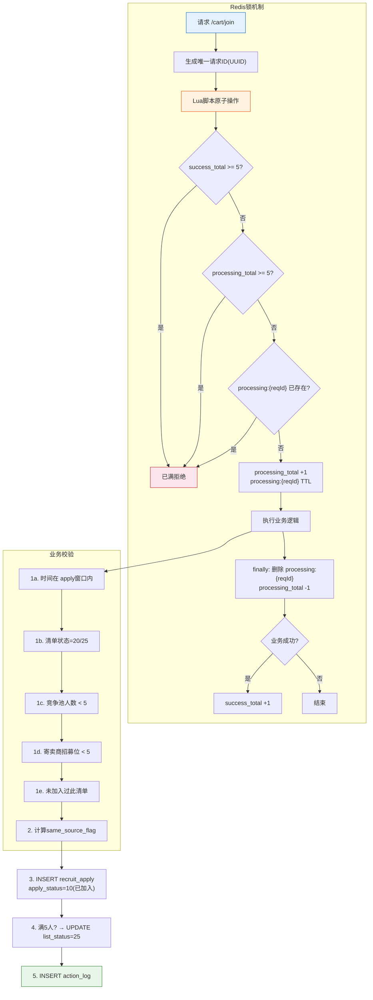

# 5-2 招募车管理

## 一、概述

| 项目 | 说明 |
|------|------|
| **PRD章节** | 2.1.4.2 招募车管理 |
| **面向用户** | 寄卖商（供应商工作台→新品开发→招募车→我的招募车） |
| **功能** | 加入/撤回/移除招募车、查看招募车列表、SKU覆盖率 |

---

## 二、数据源

### 2.1 招募车核心规则

| 规则 | 配置 | 默认值 | 说明 |
|------|------|:------:|------|
| 每个寄卖商最多5个招募位 | `supplierMaxRecruitSlot` | 5 | 同时加入的清单数上限 |
| 每张清单最多5家寄卖商 | `listMaxApplyCount` | 5 | 竞争池容量 |
| 加入后3天开CE单 | `ceCreateTimeoutDays` | 3 | 从第二天凌晨起算 |
| 21点后可撤回 | — | — | 分配前可撤回 |
| 禁止重复加入 | — | — | 同一清单只能加一次 |

### 2.2 字段来源

| 操作 | 表 | 字段 | 说明 |
|------|-----|------|------|
| **INSERT** | `recruit_apply` | `recruit_id, supplier_id, group_id, factory_id, supplier_name, apply_status=10, same_source_flag` | 加入招募车 |
| **UPDATE** | `recruit_apply` | `apply_status=100, removed_type, cancel_reason` | 撤回/移除 |
| **SELECT** | `recruit_list` | `id, factory_id` | 校验清单是否存在/满员 |
| **SELECT** | `recruit_apply` | `COUNT(*) WHERE supplier_id=? AND apply_status NOT IN (90,100)` | 当前招募车数 |
| **SELECT** | `recruit_apply` | `COUNT(*) WHERE recruit_id=? AND apply_status NOT IN (90,100)` | 竞争池人数 |

---

## 三、各功能流程

### 加入招募车流程



### 3.1 加入招募车（含Redis锁并发保护 - 文本说明）

```
请求 /cart/join
    │
    ├─ 0. Redis 锁机制（原子性加锁） ─────────────────
    │    a. 生成唯一请求ID（UUID）
    │    b. Lua 脚本原子操作：
    │       - 查 success_total >= 5 → 已满直接拒绝
    │       - 查 processing_total >= 5 → 繁忙拒绝
    │       - 查 processing:{reqId} 是否存在 → 重复请求拒绝
    │       - 原子操作: processing_total +1 & processing:{reqId}(带过期)
    │    c. 执行成功 → 继续业务逻辑
    │    d. finally: 删除 processing:{reqId}, processing_total -1
    │    e. 业务成功 → success_total +1
    │
    │ Redis Key 命名:
    │   recruit:join:processing_total:{recruitId}  → count (最多5)
    │   recruit:join:processing:{reqId}           → "1" (带TTL)
    │   recruit:join:success_total:{recruitId}    → count (上限5)
    │
    ├─ 1. 前置校验 ────────────────────────────────────────
    │    a. 当前时间必须在 apply_begin_time ~ apply_end_time 之间
    │    b. 清单 list_status IN (20-招募中, 25-已抢完)
    │    c. 竞争池人数 < listMaxApplyCount(5) —— 未满员
    │    d. 该寄卖商申请数 < supplierMaxRecruitSlot(5) —— 未达上限
    │    e. 该寄卖商未加入过该清单（禁止重复）
    │
    ├─ 2. 计算 same_source_flag ──────────────────────────
    │    判断该寄卖商（集团维度）是否已有该货源合作的SKU
    │    是 → same_source_flag=1；否 → same_source_flag=0
    │
    ├─ 3. INSERT recruit_apply ───────────────────────────
    │    recruit_id, supplier_id, group_id, factory_id
    │    supplier_name, apply_status=10(已加入)
    │    same_source_flag, create_by = 寄卖商ID
    │
    ├─ 4. 更新清单状态（条件判断） ──────────────────────
    │    如果加入后竞争池已满5人：
    │      UPDATE recruit_list SET list_status=25(已抢完)
    │      WHERE id=? AND list_status=20(招募中)
    │
    └─ 5. INSERT action_log ─────────────────────────────
        action = APPLY
```

> **崩溃恢复**: processing:{reqId} 过期后由定时任务修正 processing_total 计数。

### 3.2 撤回招募车（含Redis锁并发保护 + 移除合并）

> ⚠ **说明**：`removeCart`（移除招募车）功能已合并到 `withdrawCart`，前端只需调用 `/cart/withdraw` 一个接口即可。
> 原移除招募车逻辑与撤回相同（申请状态置为100），仅 removed_type 不同，现统一走撤回流程。
> 申请状态为 10(已加入) 且 ce_bill_no IS NULL 的均可通过撤回接口处理。

```
请求 /cart/withdraw
    │
    ├─ 0. Redis 锁机制（原子性加锁） ─────────────────
    │    a. 生成唯一请求ID（UUID）
    │    b. Lua 脚本原子操作（与 joinCart 同模式）：
    │       - 查 success_total >= maxSuccess → 已满直接拒绝
    │       - 查 processing_total >= maxProcessing → 繁忙拒绝
    │       - 查 processing:{reqId} 是否存在 → 重复请求拒绝
    │       - 原子操作: processing_total +1 & processing:{reqId}(带过期)
    │    c. 执行成功 → 继续业务逻辑
    │    d. finally: 删除 processing:{reqId}, processing_total -1
    │    e. 业务成功 → success_total +1
    │
    │ Redis Key 命名:
    │   recruit:withdraw:processing_total:{applyId} → count (最多5)
    │   recruit:withdraw:processing:{reqId}        → "1" (带TTL)
    │   recruit:withdraw:success_total:{applyId}   → count (上限10)
    │
    ├─ 1. 校验 ────────────────────────────────────────────
    │    a. apply_status=10(已加入) 且 ce_bill_no IS NULL
    │    b. 当前时间 <= apply_end_time（21点前可撤回）
    │
    ├─ 2. UPDATE recruit_apply ───────────────────────────
    │    apply_status=100(放弃/作废)
    │    removed_type='withdraw'
    │    cancel_reason='主动撤回'
    │
    ├─ 3. 更新清单状态（如果从25降为20） ────────────────
    │    如果该清单原来是25(已抢完)：
    │      UPDATE recruit_list SET list_status=20(招募中)
    │      WHERE id=? AND list_status=25(已抢完)
    │
    └─ 4. INSERT action_log ─────────────────────────────
        action = WITHDRAW
```

### 3.3 招募结果弹窗

```
请求 /cart/awardDetail
    │
    ├─ 1. 查询 recruit_list 清单信息 ────────────────────
    │
    ├─ 2. 查询该清单所有 apply 记录 ────────────────────
    │    （含已超时、已撤回的记录）
    │
    ├─ 3. 排序 ──────────────────────────────────────────
    │    - 获奖者排最前（awardResult=1）
    │    - 按 final_coverage_rate 降序
    │    - 同分按加入时间先后（ce_create_time ASC）
    │
    └─ 4. 返回排名列表 ────────────────────────────────
        - rankNo: 排名序号
        - supplierName: 供应商名称（隐藏，如"张**"）
        - applyStatus: 申请状态
        - finalCoverageRate: 最终覆盖率
        - awardResult: 评选结果
        - firstQcPassTime: 首次质检通过时间
```

### 3.4 CE单追加SKU

```
请求 /cart/appendSku
    │
    ├─ 1. 校验 ──────────────────────────────────────────
    │    a. apply_status=20(已开CE)
    │    b. ce_send_time IS NULL（未发货）
    │
    ├─ 2. 调用CE系统接口追加SKU ──────────────────────
    │    TODO: 需要CE系统提供追加SKU接口
    │
    └─ 3. INSERT action_log ────────────────────────────
        action = CE_SHIP
```

### 3.5 招募车列表查询

```
请求 /cart/page
    │
    ├─ 1. 查询该寄卖商所有apply记录 ─────────────────────
    │    SELECT * FROM recruit_apply
    │    WHERE supplier_id=? AND is_deleted=0
    │      AND apply_status NOT IN (100)  // 撤回的也展示
    │    ORDER BY create_time DESC
    │
    ├─ 2. 关联 recruit_list 获取清单详情 ─────────────────
    │    清单编号、货源工厂、产品线、预估数据等
    │
    ├─ 3. 动态计算 ──────────────────────────────────────
    │    - CE单状态（时间戳推断）
    │    - SKU覆盖率（final_coverage_rate）
    │    - 招募状态（list_status + apply_status 综合判断）
    │    - 招募结果（award_result）
    │
    └─ 4. 返回分页数据
```

---

## 四、状态走向

```
recruit_apply 在招募车中的状态变化：

       加入招募车
           │
           ▼
    10(已加入) ─── 开CE单 ──→ 20(已开CE) ──→ 30(等待评选) ──→ ...
           │                                          │
           ├── 撤回/移除 ──→ 100(放弃/作废)        获胜→40(分配完成)
           │                                          │
           └── 超3天未开单 ──→ 90(超时清出)         失败→(保留状态)

recruit_list 竞争池人数变化：
  20(招募中) ── 满5人 ──→ 25(已抢完)
  25(已抢完) ── 有人撤回 ──→ 20(招募中)
```

---

## 五、表数据处理

| 操作 | 表 | 说明 |
|------|-----|------|
| INSERT | `recruit_apply` | 加入招募车 |
| UPDATE | `recruit_apply` | 撤回/移除 更新状态 |
| UPDATE | `recruit_list` | 竞争池满员/降级更新 |
| SELECT | `recruit_apply` | 校验是否已加入、统计人数 |
| SELECT | `recruit_list` | 校验清单状态 |
| INSERT | `action_log` | 记录操作日志 |

---

## 六、难点与解决点

| 难点 | 解决 |
|------|------|
| **并发抢单（同时点击加入同一清单最后1个名额）** | 加入时使用 `SELECT ... FOR UPDATE` 悲观锁锁定清单行，或使用 `INSERT ... WHERE NOT EXISTS` 原子操作。如果并发双方都查到人数4，都插入成功→唯一键 `uniq_apply_recruit_supplier(recruit_id, supplier_id)` 保证不重复，但可能超5人 → 需要补充后置校验：INSERT后COUNT()检查是否超5人，超则回滚 |
| **满5人后同时撤回** | 推荐方案：撤回时不必立即更新list_status，交给定时任务统一校正。或者撤回时使用 `UPDATE recruit_list SET list_status=20 WHERE id=? AND list_status=25` 乐观锁 |
| **重复加入同一清单** | `uniq_apply_recruit_supplier` 唯一键保障，重复插入抛出 DuplicateKeyException |
| **撤回后竞争池释放** | 同源标志位 `same_source_flag` 在撤回时不变（已写入），但其他寄卖商不再受此影响 |
| **same_source_flag 计算** | 需要跨模块查询该寄卖商集团是否有该货源的合作SKU，调用商品/供应商模块Feign接口 |

---

## 七、CRUD API 映射

| 数据操作 | CRUD ServiceApi | 说明 |
|---------|----------------|------|
| 申请表操作 | `ConsignmentRecruitApplyServiceApi` | 加入/撤回/移除招募车 |
| 清单状态更新 | `ConsignmentRecruitListServiceApi` | 竞争池满员/降级更新 |
| 申请数量统计 | `ConsignmentRecruitApplyServiceApi` | 招募车数量、竞争池人数 |
| 操作日志 | `ConsignmentActionLogServiceApi` | 记录加入/撤回/移除操作 |

> 详细 API 方法签名参见 [8-CRUD数据操作层技术方案.md](../8-CRUD数据操作层技术方案.md#十一开放-api-接口serviceapi) 第11章
