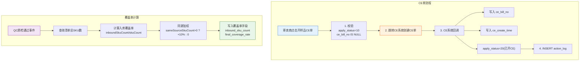

# 5-3 CE单操作与覆盖率

## 一、概述

| 项目 | 说明 |
|------|------|
| **PRD章节** | 2.1.4.2 招募车管理（CE单操作）+ 2.1.3.2 覆盖率计算 |
| **面向用户** | 寄卖商 + 运营后台 |
| **功能** | 开样品CE单、CE状态跟踪、SKU覆盖率计算与查看 |

---

## 二、数据源

### 2.1 CE单相关字段

| 字段 | 表 | 来源 | 说明 |
|------|-----|------|------|
| `ce_bill_no` | `recruit_apply` | CE系统回写 | CE单号，开单后写入 |
| `ce_create_time` | `recruit_apply` | CE系统回写 | CE开单时间 |
| `ce_send_time` | `recruit_apply` | CE系统回写 | CE发货时间 |
| `first_qc_pass_time` | `recruit_apply` | 仓储QC系统回写 | 首次质检通过时间 |

### 2.2 覆盖率相关字段

| 字段 | 表 | 来源 | 说明 |
|------|-----|------|------|
| `inbound_sku_count` | `recruit_apply` | CoverageCalc触发 | 已入库质检通过的SKU数 |
| `base_coverage_rate` | `recruit_apply` | 计算 | 入库覆盖率 = inbound / 清单总sku |
| `same_source_weight_rate` | `recruit_apply` | 加入时计算 | 同源=10%，否则=0% |
| `final_coverage_rate` | `recruit_apply` | 计算 | base + same_source_weight |

---

## 三、功能流程

### 流程总览图



### 3.1 开样品CE单（文本说明）

```
寄卖商在招募车列表点击"开样品CE单"
    │
    ├─ 1. 校验 ────────────────────────────────────────────
    │    a. apply_status=10(已加入)
    │    b. ce_bill_no IS NULL（未开过单）
    │
    ├─ 2. 跳转到CE系统创建CE单 ──────────────────────────
    │    携带参数：apply_id, supplier_id, 清单SKU列表
    │    CE系统是独立模块，通过Feign调用或页面跳转
    │
    ├─ 3. CE系统回调 ────────────────────────────────────
    │    在recruit_apply中写入：
    │    - ce_bill_no = CE系统返回的单号
    │    - ce_create_time = 当前时间
    │    - apply_status = 20(已开CE)
    │
    └─ 4. INSERT action_log ─────────────────────────────
        action = CREATE_CE
```

### 3.2 CE单追加SKU

```
寄卖商在招募车列表点击"追加SKU"
    │
    ├─ 1. 校验 ────────────────────────────────────────────
    │    a. apply_status=20(已开CE)
    │    b. ce_send_time IS NULL（未确认发货前可追加）
    │
    ├─ 2. 调用CE系统接口追加SKU ──────────────────────
    │    TODO: CE系统需提供追加SKU接口：ceServiceApi.appendSku(ceBillNo, skuIds)
    │
    └─ 3. INSERT action_log ─────────────────────────────
        action = CE_SHIP
        content = "CE单追加SKU: ceBillNo=xxx, skuCount=N"
```

### 3.3 CE状态跟踪

CE状态通过 `recruit_apply` 中的时间戳字段推断：

| CE状态 | 推断条件 | 说明 |
|--------|---------|------|
| 未开单 | `ce_bill_no IS NULL` | 已加入但未开单 |
| 已开单 | `ce_bill_no IS NOT NULL` 且 `ce_send_time IS NULL` | 已创建CE单，未发货 |
| 已发货 | `ce_send_time IS NOT NULL` 且 `first_qc_pass_time IS NULL` | 已发货，货在途中 |
| 处理完成 | `first_qc_pass_time IS NOT NULL` | 已入库且质检通过 |

### 3.4 覆盖率计算

覆盖率计算由 **QC质检通过事件** 触发，非定时任务，详见 `6-定时任务/6-3-覆盖率增量更新.md`。

寄卖商可在招募车/详情页查看当前覆盖率：

```
请求 /coverage-detail
    │
    ├─ 1. 查询 recruit_apply ─────────────────────────────
    │    获取 inbound_sku_count, base_coverage_rate,
    │    same_source_weight_rate, final_coverage_rate
    │
    └─ 2. 返回覆盖率详情 ────────────────────────────────
```

---

## 四、状态走向

```
recruit_apply 在CE流程中的状态变化：

  10(已加入) ── 开CE单 ──→ 20(已开CE) ── 发货 ──→
       │                       │
       │  (ce_bill_no IS NULL) │  (ce_bill_no NOT NULL,
       │                        │   ce_send_time IS NULL)
       │                       │
       ▼                       ▼
  90(超时清出)              30(等待评选) ←── 处理完成
                               │        (first_qc_pass_time NOT NULL)
                               │
                               ▼
                         覆盖率计算结果（增量更新，状态不变）
```

---

## 五、表数据处理

| 操作 | 表 | 说明 |
|------|-----|------|
| UPDATE | `recruit_apply` | CE开单后写入 `ce_bill_no, ce_create_time, apply_status=20` |
| UPDATE | `recruit_apply` | CE发货后写入 `ce_send_time` |
| UPDATE | `recruit_apply` | QC通过后写入 `first_qc_pass_time, inbound_sku_count, coverage_rate` |
| SELECT | `recruit_apply` | 查询覆盖率和CE状态 |
| INSERT | `action_log` | CE操作日志 |

---

## 六、难点与解决点

| 难点 | 解决 |
|------|------|
| **CE系统是独立系统**，开CE单需要跨系统交互 | 页面跳转到CE系统，CE系统通过MQ/回调通知本系统结果。本系统暴露回调接口接收CE单号 |
| **CE系统中发货/入库/质检状态需要同步** | 仓储QC系统在质检完成后，发送MQ消息（含apply_id、质检通过SKU列表），本系统消费后更新覆盖率 |
| **CE状态推断的边界条件** | 时间戳精确到毫秒级，推断逻辑为：
1. `first_qc_pass_time != NULL` → 处理完成
2. `first_qc_pass_time == NULL && ce_send_time != NULL` → 已发货
3. `ce_send_time == NULL && ce_bill_no != NULL` → 已开单
4. `ce_bill_no == NULL` → 未开单 |
| **开CE单后清单SKU数据关联** | 开CE单时需传入该清单的所有SKU信息，CE系统内部处理哪些SKU实际寄样 |

---

## 七、CRUD API 映射

| 数据操作 | CRUD ServiceApi | 说明 |
|---------|----------------|------|
| 申请表更新 | `ConsignmentRecruitApplyServiceApi` | CE开单后写入 ce_bill_no/ce_create_time/apply_status |
| 覆盖率更新 | `ConsignmentRecruitApplyServiceApi` | QC通过后更新覆盖率字段 |
| 清单SKU数 | `ConsignmentRecruitListServiceApi` | 读取 sku_count 用于覆盖率计算 |
| 操作日志 | `ConsignmentActionLogServiceApi` | 记录CE操作日志 |

> 详细 API 方法签名参见 [8-CRUD数据操作层技术方案.md](../8-CRUD数据操作层技术方案.md#十一开放-api-接口serviceapi) 第11章
