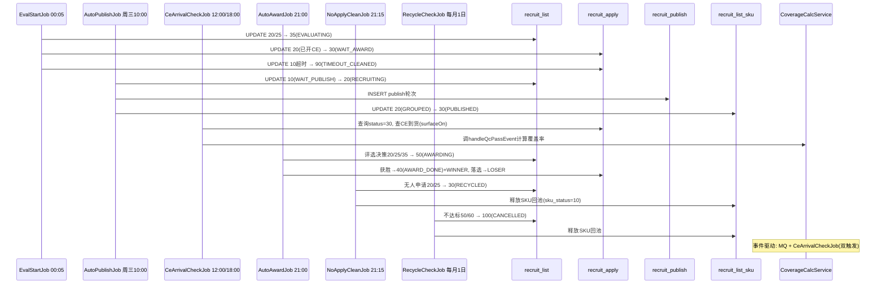

# 6-0 任务间依赖与防故障策略

## 一、背景

- **自动组单任务 (AutoGroupJob)**: 由另一研发负责，每天凌晨2:00执行，从招募池取SKU组单生成待发布清单
- **自动发布及后续任务**: 由我们负责，依赖 AutoGroupJob 产出的数据作为上游输入
- **核心问题**: 对方代码风格、命名习惯、异常处理方式可能与我们有差异，需做防御性设计保障后续任务不受影响

---

## 二、任务全链路与执行时序



---

## 三、清单状态完整流转链路

```
10(待发布) → 20(招募中) → [25(已抢完)] → 35(评选中) → 50(分配中) → 60(清单完成)
                │                                         │
                └─── 30(无人申请已回收)                     └─── 100(作废)
```

| 状态 | 枚举 | 说明 | 触发Job |
|------|------|------|---------|
| 10 | WAIT_PUBLISH | 待发布 | AutoGroupJob(组单) |
| 20 | RECRUITING | 招募中 | AutoPublishJob(发布) |
| 25 | FULL_SNAPPED | 已抢完 | 前端操作(抢满5人) |
| 30 | NO_APPLY_RECYCLED | 无人申请已回收 | NoApplyCleanJob |
| **35** | **EVALUATING** | **评选中** | **EvalStartJob(发布结束，同步apply→30)** |
| 50 | AWARDING | 分配中 | AutoAwardJob(评选) |
| 60 | COMPLETED | 清单完成 | 业务流程 |
| 100 | CANCELLED | 作废 | RecycleCheckJob(回收) |

---

## 四、接口耦合点分析

### 4.1 共享表清单

| 表 | 写入方 | 读取方 | 耦合度 |
|-----|--------|--------|--------|
| `recruit_list` | AutoGroupJob (INSERT) | AutoPublishJob, EvalStartJob, NoApplyCleanJob, AutoAwardJob, RecycleCheckJob | **高** |
| `recruit_list_sku` | AutoGroupJob (UPDATE) | AutoPublishJob, NoApplyCleanJob, CeArrivalCheckJob, RecycleCheckJob | **中** |
| `CommonDictConfig` | 双方读取 | 所有Job | 低 |
| `recruit_publish` | AutoPublishJob (INSERT) | EvalStartJob (UPDATE), 下游任务间接依赖 | 低 |
| `recruit_apply` | 寄卖商操作 / CeArrivalCheckJob | AutoAwardJob, NoApplyCleanJob, CeArrivalCheckJob | 低（与组单无关） |

### 4.2 关键字段耦合明细

#### 4.2.1 `recruit_list` 表 — AutoGroupJob INSERT → 我们SELECT

| 字段 | AutoGroupJob写入方式 | 我们读取方式 | 风险 |
|------|---------------------|-------------|------|
| `id` | 数据库自增 | 作为清单唯一标识 | 低（数据库保障） |
| `list_status` | 写入 `10`(待发布) | 条件查询 `WHERE list_status = 10` | **中 — 若对方写错值则查不到** |
| `list_type` | 写入 `1`(自营转寄卖) | 部分查询条件可能用到 | **低 — 可放宽条件改为 NOT IN 排除法** |
| `recruit_no` | 写入 `SC{yyMMdd}{4位自增}` | 透传到 recruit_publish | 低 — 仅做展示透传 |
| `factory_id`, `category_id` | 写入 | 透传 | 低 |
| `sku_count` | 写入 | AutoPublishJob不使用，但下游可能用 | **低 — 不影响主流程** |
| `create_time` | 数据库自动 | 排序用 `ORDER BY create_time` | 低 |
| `group_time` | 写入 | AutoPublishJob不使用 | 低 |

#### 4.2.2 `recruit_list_sku` 表 — AutoGroupJob UPDATE → 我们UPDATE

| 字段 | AutoGroupJob写入 | 我们读取 | 风险 |
|------|-----------------|---------|------|
| `recruit_id` | 设置为新清单ID | 作为关联条件 | **中 — 若未正确设置则SKU无法关联** |
| `sku_status` | 更新为 `20`(已组单) | 条件 `WHERE sku_status = 20` | **中 — 若值不同则更新不到** |
| `sku_id` | 透传（不变） | 只做关联 | 低 |

### 4.3 枚举值一致性要求

双方必须使用同一套枚举值，不能硬编码数字：

| 枚举 | 值定义 | 风险场景 |
|------|--------|---------|
| `list_status` = `10`(待发布) | `ConsignmentRecruitListStatusEnum.WAIT_PUBLISH.code` | 2个研发都写 `10` 数字，只要改了一边就出问题 |
| `list_status` = `35`(评选中) | `ConsignmentRecruitListStatusEnum.EVALUATING.code` | 新增状态，需确保双方引用同一枚举 |
| `sku_status` = `20`(已组单) | `ConsignmentRecruitSkuStatusEnum.GROUPED.code` | 同上 |
| `list_type` = `1`(自营转寄卖) | 常量 `CONSIGNMENT_TYPE` | 同上 |

---

## 五、预防策略总览

### 策略1: 使用枚举常量而非硬编码数字

**原则**: 所有状态值比较使用 `枚举类.getCode()`，绝对不写 `10`, `20` 等魔数

```java
// ✅ 正确：使用枚举常量
list_status = ConsignmentRecruitListStatusEnum.WAIT_PUBLISH.getCode()

// ❌ 错误：硬编码数字
list_status = 10
```

**沟通**: 需要与另一研发约定，双方都引用 `pa-common-service-api` 中的枚举类，不自行定义

### 策略2: AutoPublishJob 读取时增加防御性校验

**原则**: 读取待发布清单后，先校验字段完整性再处理

```java
// 防御性校验：过滤异常数据
list = list.stream()
    .filter(po -> po.getId() != null && po.getId() > 0)
    .filter(po -> po.getSkuCount() != null && po.getSkuCount() > 0)
    .filter(po -> po.getGroupTime() != null)
    .collect(Collectors.toList());
```

### 策略3: 乐观锁隔离

**原则**: 使用乐观锁条件保障我们只操作状态正确的数据，异常数据不会被误操作

所有 UPDATE 操作都带状态条件：

```sql
-- AutoPublishJob 更新清单
UPDATE recruit_list 
SET list_status = 20
WHERE id = ? AND list_status = 10   -- ← 乐观锁条件

-- AutoPublishJob 更新SKU
UPDATE recruit_list_sku
SET sku_status = 30
WHERE recruit_id = ? AND sku_status = 20  -- ← 乐观锁条件
```

### 策略4: 空数据容忍

**原则**: 每个 Job 在读取到空数据时必须正常结束，不能抛异常

### 策略5: 执行结果监控

**原则**: 每个 Job 记录执行指标（总数/成功/失败/耗时），便于排查上游数据问题

### 策略6: 数据边界校验

**原则**: 对上游数据的合法性做边界检查，不接受明显的脏数据

---

## 六、各Job的具体防护措施

| Job | 依赖AutoGroupJob | 防护措施 |
|-----|-----------------|---------|
| **AutoPublishJob** (6-2) | 高 — 读取其 INSERT 的 `recruit_list` | ①字段完整性校验 ②乐观锁条件 ③空数据容忍 ④数据边界校验 |
| **EvalStartJob** (6-9) | 低 — 读取已发布清单 | ①乐观锁条件 ②空数据容忍 ③award_time判空 ④apply状态幂等同步 ⑤不影响覆盖率数据 |
| **CeArrivalCheckJob** (6-10) | 无 — 只读 recruit_apply | ①Feign异常隔离 ②覆盖率计算异常隔离 ③空数据容忍 |
| **NoApplyCleanJob** (6-7) | 中 — 读取其 INSERT 的 `recruit_list.list_status` | ①乐观锁条件 ②空数据容忍 ③日志记录 |
| **AutoAwardJob** (6-4) | 低 — 不直接读取组单数据 | ①乐观锁条件 ②空数据容忍（自动过滤上游问题清单） |
| **RecycleCheckJob** (6-8) | 低 — 不直接读取组单数据 | ①乐观锁条件 ②空数据容忍 |
| **CeTimeoutCleanJob** (6-5) | 无 — 只读 recruit_apply | 不需要 — 已合并到EvalStartJob (6-9) |
| **CoverageCalcService** (6-3) | 无 — MQ事件 + CeArrivalCheckJob | 不需要 |

---

## 七、与另一研发的沟通契约

### 7.1 必须统一的事项

| 事项 | 约定内容 | 未对齐的风险 |
|------|---------|-------------|
| 枚举类路径 | `com.ux168.pa.service.common.constants.consignment.recruit.enums.*` | 双方使用不同枚举值 |
| 状态值定义 | `list_status=10(WAIT_PUBLISH)`, `sku_status=20(GROUPED)` | 值不一致导致上下游匹配不上 |
| `recruit_no` 格式 | `SC{yyMMdd}{4位自增}` | 编号格式不一致 |
| `list_type` 值 | `1` = 自营转寄卖 | 查询条件不匹配 |
| 动态配置key | 统一从 `CommonDictConfig` 读取 | 配置key不一致 |

### 7.2 异常场景隔离清单

| 对方异常场景 | 对我们任务的影响 | 防护措施生效情况 |
|-------------|----------------|----------------|
| AutoGroupJob 未执行（凌晨2:00挂了） | AutoPublishJob 无数据可发布 | ✅ 空数据容忍，本周无新发布 |
| AutoGroupJob 写入 list_status=1（值不对） | 我们查不到待发布清单 | ✅ 乐观锁条件自动过滤，不误操作 |
| AutoGroupJob 写入 sku_status=2（值不对） | SKU更新条件不匹配 | ✅ 乐观锁条件自动过滤，不误操作 |
| AutoGroupJob 未设置 recruit_id | SKU无法关联到清单 | ✅ 校验阶段跳过异常数据 |
| AutoGroupJob 写入字段为NULL | 下游使用NPE | ✅ 边界校验 + 空安全处理 |
| AutoGroupJob 写入大量数据（超过20条） | 每日上限 `dailyMaxPublishCount` 只处理前N条 | ✅ 正常分批次 |

---

## 八、总结

| 维度 | 结论 |
|------|------|
| **是否影响我们的任务** | 有潜在影响，但**可控** |
| **主要风险点** | 枚举值不一致、字段为空、状态错乱 |
| **防护层级** | 6层：枚举常量→防御性校验→乐观锁→空数据容忍→边界检查→监控告警 |
| **最高原则** | **异常数据不会被误操作，只会被跳过**（乐观锁 + 过滤条件） |
| **需要对方配合** | 统一枚举类引用、状态值约定 |
| **不需要对方配合** | 即使对方完全不按规范，我们的乐观锁条件也会自动过滤异常数据，不会造成数据污染 |
