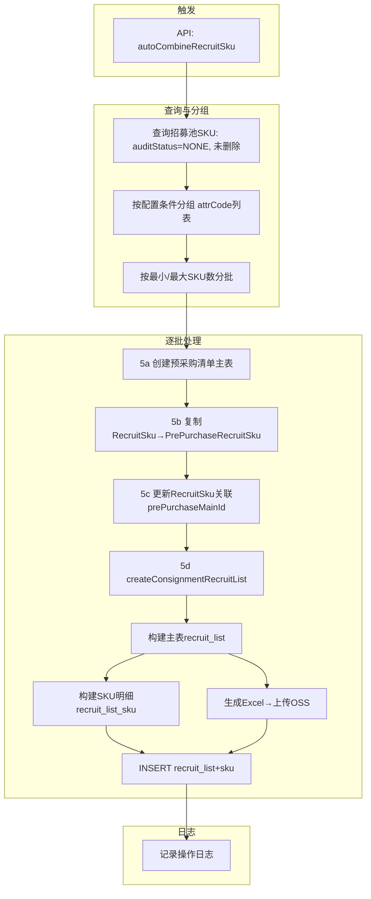

# 6-1 自动生成待发布招募清单

## 一、总体流程



---

## 二、触发方式

### 2.1 API 触发

| 属性 | 值 |
|------|-----|
| 路径 | `POST /api/scms/prePurchaseWorkflow/v1/autoCombineRecruitSku` |
| 实现类 | `PrePurchaseWorkflowServiceApiImpl.autoCombineRecruitSku()` |
| 方法 | `PrePurchaseWorkflowServiceImpl.autoCombineRecruitSku()` |

### 2.2 功能开关

配置键：`PA_SCMS_PRE_PURCHASE_AUTO_WORKFLOW`（`BusinessConfigKeyConstants`）

关键开关字段：

| 字段 | 类型 | 说明 |
|------|------|------|
| `ableAutoCombineRecruit` | Boolean | 总开关，为 true 才执行 |
| `combineRecruitConfig.combineConditionList` | List | 分组条件字段配置（attrCode 列表） |
| `combineRecruitConfig.preCombineMaxSkuNum` | Integer | 每单最大 SKU 数（默认 200） |
| `combineRecruitConfig.preCombineMinSkuNum` | Integer | 每单最小 SKU 数（默认 10） |
| `combineRecruitConfig.totalCombineBillNum` | Integer | 本次最大生成清单数（默认 20） |

---

## 三、招募池数据查询

### 3.1 查询条件

| 条件 | 值 | 含义 |
|------|-----|------|
| `prePurchaseAuditStatus` | `NONE` (0) | 未关联预采购清单 |
| `isDeleted` | `NOT_DELETED` (0) | 未删除 |
| 排序 | `skuId ASC` | 按 skuId 升序 |

### 3.2 数据来源表

| 表 | 别名 | 说明 |
|-----|------|------|
| `scms_recruit_sku` | RecruitSkuPO | 招募池SKU，源数据 |
| `scms_pre_purchase_recruit_sku` | PrePurchaseRecruitSkuPO | 预采购清单-招募池关联（步骤5b写入） |

---

## 四、分组与分批逻辑

### 4.1 分组

将 `RecruitSkuPO` 反射为 `Map<String, String>`（字段名→字段值），按配置的 `combineConditionList` 中的 `attrCode` 作为分组 key，相同 key 的 SKU 归为一组。

```java
// 分组 key 示例（假设配置了 paFactoryId + categoryId）：
// "1001-2001" 为一个分组
String groupId = StringUtils.join(groupItemList, "-");
```

### 4.2 分批

对每个分组内的 SKU ID 列表，按以下规则拆分为最终批次：

| 规则 | 处理 |
|------|------|
| 分组大小 ≤ maxSkuNum && ≥ minSkuNum | 直接作为一个批次 |
| 分组大小 > maxSkuNum | `Lists.partition(group, maxSkuNum)` 拆分子批次 |
| 分组大小 < minSkuNum | 舍弃 |
| 总批次数 > totalCombineBillNum | 截取前 totalCombineBillNum 个批次 |

---

## 五、批次处理流程（逐批事务）

每批独立事务，失败仅回滚当前批次。

### 5a. 创建预采购清单主表

| 源 | 目标字段 | 值/来源 |
|----|---------|---------|
| 生成 | `prePurchaseBillNo` | `batchNoService.generateByShortYMD(RECRUIT_BILL_NO)` |
| 常量 | `auditStatus` | `FINISHED`（已审核，跳过审核环节） |
| 常量 | `createBy` / `updateBy` | `AUTO_WORKFLOW_OPERATOR`（system） |
| 常量 | `supplierType` | `CONSIGNMENT`（寄卖） |
| 常量 | `prePurchaseSupplierType` | `SELF_TO_CONSIGNMENT`（自营转寄卖） |

### 5b. 复制 RecruitSku → PrePurchaseRecruitSku

使用 `BaseConvert.convert(RecruitSkuPO, PrePurchaseRecruitSkuBO.class)` 复制字段，补充：

| PrePurchaseRecruitSkuBO 字段 | 值来源 |
|---------------------------|--------|
| `recruitSkuPkId` | `RecruitSkuPO.id` |
| `prePurchaseMainId` | 步骤5a 生成的 ID |
| `prePurchaseBillNo` | 步骤5a 生成的单号 |
| `auditStatus` | `FINISHED` |
| `updateBy` | `AUTO_WORKFLOW_OPERATOR` |
| `id` | null（新插入） |

### 5c. 更新 RecruitSku

更新 `scms_recruit_sku` 表，关联预采购清单：

| 字段 | 值 |
|------|-----|
| `prePurchaseMainId` | 新创建的 prePurchaseMainId |
| `prePurchaseBillNo` | 新生成的单号 |
| `prePurchaseAuditStatus` | `FINISHED` |

---

## 六、createConsignmentRecruitList 流程

### 6.1 数据来源

| 序号 | 来源对象 | 对应表 | 说明 |
|:----|---------|--------|------|
| 1 | `PrePurchaseMainPO` | `scms_pre_purchase_main` | 预采购清单主表（步骤5a创建），提供 `prePurchaseBillNo` |
| 2 | `RecruitSkuPO` | `scms_recruit_sku` | 招募池SKU数据，作为主表维度和明细数据源 |
| 3 | `ProductDevSkuBO` | `ppms_product_dev_sku` | 补充SKU名称（outsideTitle / insideTitle） |
| 4 | `ProductSkuFeignClient`（POMS V2） | — | 获取SKU扩展属性（毛重、包装、卖数、单位等） |
| 5 | `SkuSourcePO` | `scms_sku_source` | 获取交货天数（deliveryDay） |

### 6.2 ConsignmentRecruitListPO 字段映射

#### 来自 PrePurchaseMainPO

| 源字段 | 处理 | 目标字段 |
|--------|------|---------|
| `prePurchaseBillNo` | 直接赋值 | `recruitNo` |

#### 来自 RecruitSkuPO（取批次首个SKU）

| 源字段 | 处理 | 目标字段 |
|--------|------|---------|
| `paFactoryId` | `paFactoryId != null ? paFactoryId : factoryId.longValue()` | `factoryId` |
| `factoryFullName` | 直接赋值 | `factoryName` |
| `categoryId` | `categoryId != null ? categoryId.longValue() : null` | `categoryId` |
| `categoryFullId` | 直接赋值 | `categoryFullPathId` |

#### 汇总计算

| 汇总项 | 计算公式 |
|--------|---------|
| `skuCount` | `batch.size()` |
| `estimatedCost` | `Σ(cost × moq)`，仅当 cost 和 moq 均非空时累加 |
| `estimatedMonthSaleQty` | `Σ(sold30)`，仅当 `sold30 > 0` 时累加 |
| `estimatedMonthSaleAmount` | `Σ(cost × sold30)`，仅当 `sold30 > 0` 且 cost 非空 |
| `avgMoq` | `Σ(moq) / moqCount`，scale=2, HALF_UP |

#### 固定值

| 目标字段 | 值 | 含义 |
|---------|-----|------|
| `listStatus` | `WAIT_PUBLISH` | 待发布（状态码 10） |
| `listType` | `SELF_TO_CONSIGNMENT` | 自营转寄卖 |
| `groupTime` | `new Date()` | 组单时间 = 当前系统时间 |

### 6.3 ConsignmentRecruitListSkuPO 字段映射

| 源 | 源字段 | 处理 | 目标字段 |
|----|-------|------|---------|
| — | — | 自增序号（`AtomicInteger`） | `seqNo` |
| — | — | `recruitList.getId()` 回写 | `recruitId` |
| — | — | 同主表 `recruitNo` | `recruitNo` |
| RecruitSkuPO | `devSkuPkId` | 直接赋值 | `skuId`（存储 ppms id） |
| RecruitSkuPO | `paFactoryId` | `paFactoryId != null ? paFactoryId : factoryId.longValue()` | `factoryId` |
| RecruitSkuPO | `factoryFullName` | 直接赋值 | `factoryName` |
| RecruitSkuPO | `purchaseLink` | 直接赋值 | `sourceUrl` |
| RecruitSkuPO | `categoryId` | `categoryId != null ? categoryId.longValue() : null` | `categoryId` |
| RecruitSkuPO | `cost` | 直接赋值 | `costPrice` |
| RecruitSkuPO | `moq` | 直接赋值 | `moq` |
| RecruitSkuPO | `sold30` | 直接赋值 | `saleQty30d` |
| — | — | 常量 `GROUPED` | `skuStatus` |
| ProductDevSkuBO | `outsideTitle` | `defaultString(outsideTitle, insideTitle)` | `skuName` |
| ProductDevSkuBO + POMS V2 | 型号(attrCode=model) | `extInfo.getProductModel()` | `productModel` |
| ProductDevSkuBO + POMS V2 | 车型(attrCode=make) | `extInfo.getVehicleModel()` | `vehicleModel` |
| ProductDevSkuBO + POMS V2 | 包装(attrCode=package_require) | `extInfo.getPackageInfo()` | `packageInfo` |
| ProductDevSkuBO + POMS V2 | 货源型号 | `extInfo.getSourceModel()` | `sourceModel` |
| POMS V2 | 卖数(Item Unit Quantity) | `extInfo.getSalesQuantity()` | `salesQuantity` |
| POMS V2 | 单位 | `extInfo.getUnit()` | `unit` |
| POMS V2 | 毛重(kg×1000) | `extInfo.getGrossWeightG()` | `grossWeightG` |
| POMS V2 | 包装尺寸(Pack Size) | `extInfo.getPackageSizeCm()` | `packageSizeCm` |

### 6.4 Excel 生成与 OSS 上传

在 主表 save() 之前执行，生成的 OSS 链接写入 `listPO.fileUrl`：

| 步骤 | 说明 |
|------|------|
| 构建列头 | 序号, Sku, 产品型号, 车型, 中文描述, 卖数, 单位, 包装, 毛重(G), 包装尺寸(CM), 货源型号, 采购链接, 交货周期(天), 来货数, 寄卖单价(元) |
| 构建数据行 | 每条 RecruitSkuPO 一行，结合 `ConsignmentSkuExtInfoBO`（POMS扩展资料）和 `SkuSourcePO.deliveryDay` |
| 输出文件 | `EasyExcel.write(outputStream)` → `ByteArrayOutputStream` → `ByteArrayInputStream` |
| 上传路径 | `pa/consignment/recruit/{recruitNo}-{timestamp}.xlsx` |
| 上传方法 | `aliOSSService.uploadToOSS(inputStream, path, true, 3600)` |
| 权限 | 公开读（overwrite=true），有效期3600秒 |

**数据补充**：

| Excel 列 | 数据来源 |
|---------|---------|
| 交货周期(天) | `SkuSourcePO.deliveryDay`（通过 `skuId` 批量查询 `scms_sku_source`） |
| 来货数 | `RecruitSkuPO.moq` |
| 寄卖单价(元) | `RecruitSkuPO.cost` |

---

## 七、事务边界

### 7.1 外层事务（步骤5全局）

`autoCombineRecruitSku()` 中每批独立事务：

```java
TransactionStatus transaction = transactionManager.getTransaction(new DefaultTransactionDefinition());
try {
    // 5a. 创建预采购清单
    // 5b. 复制 PrePurchaseRecruitSku
    // 5c. 更新 RecruitSku
    // 5d. createConsignmentRecruitList（含Excel上传 + 主表INSERT + 明细INSERT）
    if (!transaction.isCompleted()) transactionManager.commit(transaction);
} catch (Exception e) {
    if (!transaction.isCompleted()) transactionManager.rollback(transaction);
}
```

### 7.2 内层一致性

`createConsignmentRecruitList` 无单独事务，依赖外层事务。
主表 `save()` 和明细 `insertBatch()` 在同一事务内，Excel 上传（OSS 操作）不在事务内，但 fileUrl 写入主表与 INSERT 在同一事务。

---

## 八、关键依赖方法

| 方法 | 所属对象 | 说明 |
|------|---------|------|
| `findList(queryBO)` | `recruitSkuService` | 查询招募池待处理SKU |
| `createRaw(PO)` | `prePurchaseMainService` | 创建预采购清单主表 |
| `createBatch(list)` | `prePurchaseRecruitSkuService` | 批量写入招募池关联 |
| `updateBatch(list)` | `recruitSkuService` | 更新招募池关联状态 |
| `save(entity)` | `consignmentRecruitListRepository` | 保存招募清单主表（自动回写ID） |
| `insertBatch(list)` | `consignmentRecruitListSkuRepository` | 批量保存SKU明细 |
| `findByIds(ids)` | `productDevSkuService` | 根据 devSkuPkId 查询 ProductDevSkuBO |
| `findList(queryBO)` | `skuSourceService` | 根据 skuId 列表查询货源表 |
| `buildConsignmentSkuExtInfoMap(ids)` | 本类方法 | 集中查询 POMS V2 扩展资料 |
| `buildAndUploadRecruitListExcel(...)` | 本类方法 | 生成 Excel 并上传 OSS |
| `findList(queryBO)` | `prePurchaseRecruitSkuService` | 查询 PrePurchaseRecruitSku |

---

## 九、下游消费

生成后的 `recruit_list` 状态为 `WAIT_PUBLISH`（10），由以下任务消费：

| 任务 | 时机 | 处理 |
|------|------|------|
| `AutoPublishJob` (6-2) | 每周三 10:00 | 获取 list_status=10，发布为正式招募（状态 10→20） |
| `EvalStartJob` (6-9) | 每天 00:05 | publishEndTime 到期后将 20/25 流转为 35(评选中) |
| `CeArrivalCheckJob` (6-10) | 每天 12:00/18:00 | CE到货质检查询，触发覆盖率计算，可能触发评选 |
| `AutoAwardJob` (6-4) | 每天 21:00 | 对已截止申请的做评选分配（查询 20/25/35） |
| `NoApplyCleanJob` (6-7) | 每天 21:15 | 清理已发布但无人申请的 |
| `AwardWaitCheckJob` (6-6) | 每天 21:30 | CASE C 兜底（14天等待期，查询 20/25/35） |
| `RecycleCheckJob` (6-8) | 每月1日 04:00 | 回收持续不达标清单 |

**完整状态流转链路**：
```
10(待发布) → 20(招募中) → [25(已抢完)] → 35(评选中) → 50(分配中) → 60(清单完成)
```
其中 35(评选中) 由 EvalStartJob 在 publishEndTime 到期后自动流转。
