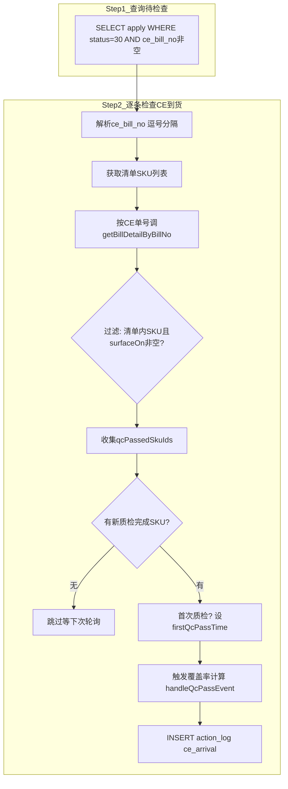

# 6-10 CE到货/质检查询任务 - CeArrivalCheckJob

## 一、概述

| 项目 | 说明 |
|------|------|
| **调度频率** | 每天 12:00 / 18:00（每天两次轮询） |
| **XXL-Job Handler** | `consignmentRecruitCeArrivalCheckJobHandler` |
| **Service** | `ConsignmentRecruitCeArrivalCheckService` |
| **核心逻辑** | 仅查 status=30(等待评选) 的 apply，通过 CE 系统 `surfaceOn` 字段判断质检完成，计算覆盖率+同源加权(`sameSourceSkuCount>0→10%`) |
| **操作者** | `SYSTEM_CE_ARRIVAL_CHECK_OPERATOR` = `system(CE到货质检)` |
| **触发模式** | 本Job定时轮询（每天12:00/18:00）+ MQ事件驱动 **双触发**
| **评选触发** | 本Job不再触发评选，评选仅由 AutoAwardJob (6-4) 每天21:00定时调度 |
| **注意** | 仅处理已处于30的apply。EvalStartJob(6-9)已将已开CE单的apply→30，CeArrivalCheck 专注质检检测+覆盖率计算 |

---

## 二、数据源

| 操作 | 表/配置 | 字段 | 说明 |
|------|---------|------|------|
| **读取** | `recruit_apply` | `id, recruit_id, ce_bill_no, first_qc_pass_time, apply_status` | 筛选已到30的申请 |
| **读取** | `recruit_list_sku` | `sku_id` | 清单关联的SKU列表 |
| **读取** | `CommonDictConfig` | `awardWaitDays(14)` | 等待期配置 |
| **本地调用** | `CetsBillQueryService` | `getBillDetailByBillNo(billNo)` → 内部封装 `CetsNodeJsAppFeignClient.queryPage` |
| **写入** | `recruit_apply` | `first_qc_pass_time` | 首次质检通过时更新（状态已为30） |
| **调用** | `CoverageCalcService.handleQcPassEvent()` | — | 触发覆盖率计算 |
| **写入** | `action_log` | `action=ce_arrival` | 操作日志 |

---

## 三、CE到货查询封装

| 项目 | 说明 |
|------|------|
| **封装类** | `CetsBillQueryService`（scms-service-biz，与 Job 同包） |
| **底层调用** | `CetsNodeJsAppFeignClient.queryPage(Map<String, Object>)` |
| **Feign服务** | `cets_nodejs_app`（Node.js 收货明细服务） |
| **请求参数** | `Map { billNo }`（按CE单号查所有SKU） 或 `Map { billNo, skuId }`（按单号+SKU查） |
| **响应** | `NodePageRespDTO<NewReceiveDetailDTO>` → 取 `data` 列表（`billBoxNo, billNo, skuId, billDetailId, receiveQty, surfaceOn`） |
| **依赖链** | `scms-service-biz → pa-common-service-biz → pa-common-service-api`（含 `CetsNodeJsAppFeignClient`） |

### 3.1 提供的两种查询方法

| 方法 | 参数 | 说明 | 适用场景 |
|------|------|------|---------|
| `getBillDetail(billNo, skuId)` | 单号+SKU ID | 按单号和SKU精确查询 | 单SKU查询场景 |
| `getBillDetailByBillNo(billNo)` | 仅CE单号 | 按CE单号查所有SKU到货明细（一次Feign调用） | **CeArrivalCheckJob使用**，避免逐SKU调用 |

> **架构说明**：`CetsNodeJsAppFeignClient` 已在 `pa-common-service-api` 中提供，scms-service 可直接通过依赖链使用，无需额外 Feign 客户端或跨模块 API。

---

## 四、标准流程



---

## 五、评选时机说明

评选**不再**由本Job触发。CeArrivalCheckJob 仅负责检测CE到货、更新 `firstQcPassTime` 和触发覆盖率计算。

评选决策统一由 **AutoAwardJob (6-4)** 每天 21:00 定时调度：
- CASE A: 有人覆盖率 >= 80% → 直接获胜
- CASE B: 无人达标，但最早QC通过时间已过14天等待期 → 最高者获胜
- CASE C: 条件不满足 → 继续等待，下次调度重试

---

## 六、状态走向

```
recruit_apply:
  30(等待评选) ─── surfaceOn非空检测到质检完成 ───→ 更新覆盖率(30不变)
  30(等待评选) ─── 首次质检完成 ───→ first_qc_pass_time记录时间
  （apply_status=30 由 EvalStartJob 提前设置，本Job不再改状态）

recruit_list（由 AutoAwardJob 触发）:
  35(评选中) ─── AutoAwardJob评选 ───→ 50(分配中)
  20/25 ─── AutoAwardJob评选 ───→ 50(分配中)
```

---

## 七、表数据处理

| 操作 | 表 | 说明 |
|------|-----|------|
| SELECT | `recruit_apply` | `WHERE apply_status=30 AND ce_bill_no IS NOT NULL` |
| SELECT | `recruit_list_sku` | 获取清单关联SKU列表 |
| 本地调用 | `CetsBillQueryService` | `getBillDetailByBillNo(billNo)` → `CetsNodeJsAppFeignClient.queryPage`（按单号批量查所有SKU） |
| UPDATE | `recruit_apply` | 首次质检完成时更新 `first_qc_pass_time`（状态已是30） |
| 调用 | `CoverageCalcService` | `handleQcPassEvent(applyId, qcPassedSkuIds)` |
| INSERT | `action_log` | `action=ce_arrival` |

---

## 八、与覆盖率计算的关系

覆盖率更新采用 **双触发** 机制：

| 触发方式 | 说明 |
|---------|------|
| **MQ事件驱动** | 仓储QC系统质检通过 → MQ消息 → 消费端调 `handleQcPassEvent` |
| **CeArrivalCheckJob定时轮询** | 每天12:00/18:00 → CetsBillQueryService查CE到货 → 调 `handleQcPassEvent` |

两种方式最终都调用同一个 `CoverageCalcService.handleQcPassEvent()` 方法，保障覆盖率数据一致性。

---

## 九、难点与解决点

| 难点 | 解决 |
|------|------|
| **ce_bill_no 可能逗号分隔多个CE单号** | `ceBillNos.split(",")` 拆分后逐单号查询 |
| **多条SKU查CE到货：Feign调用过多（N×M次）** | 优化为 `getBillDetailByBillNo(billNo)` 按单号查所有SKU一次到位（M次Feign调用） |
| **Feign调用可能失败** | catch 异常只记录 warn 日志，不影响其他SKU/单号的处理 |
| **同一SKU在多个CE单号下都有到货** | `qcPassedSkuIds.contains()` 去重，同一SKU只计一次 |
| **覆盖率计算失败不影响主流程** | catch 异常只记录 error 日志，继续执行后续步骤 |
| **评选决策已在AutoAwardJob中统一处理** | 本Job不再触发评选，仅记录覆盖率数据供AutoAwardJob使用 |
| **空数据容忍** | 无待检查的CE申请时记录INFO日志正常结束 |
