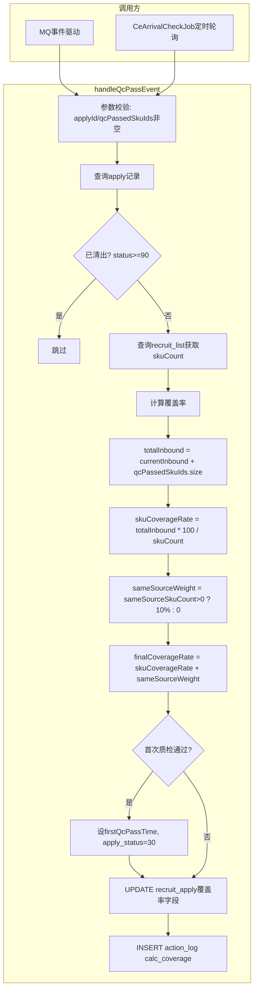

# 6-3 覆盖率增量更新 - CoverageCalcService

## 一、概述

| 项目 | 说明 |
|------|------|
| **触发方式** | **双触发**：MQ事件驱动 + CeArrivalCheckJob定时轮询 |
| **Service** | `ConsignmentCoverageCalcService` |
| **核心方法** | `handleQcPassEvent(applyId, qcPassedSkuIds)` |
| **核心逻辑** | 某寄卖商有货物质检通过时，增量更新其对清单的覆盖率数据 |
| **操作者** | `SYSTEM_COVERAGE_CALC_OPERATOR` = `system(覆盖率更新)` |
| **备注** | 非独立定时Job，作为公共方法被 MQ消费端 和 CeArrivalCheckJob 调用 |

---

## 二、调用方

| 调用方 | 触发方式 | 说明 |
|--------|---------|------|
| **MQ消费端** | 仓储QC系统质检通过 → MQ消息 | 原始事件驱动，实时性高 |
| **CeArrivalCheckJob** (6-10) | 每天12:00/18:00 定时轮询 | Feign查CE到货后调 `handleQcPassEvent`，作为MQ的补充保障 |

两种方式最终都调用同一个 `handleQcPassEvent()` 方法，保障覆盖率数据一致性。

---

## 三、数据源

### 3.1 输入

| 字段 | 来源 | 说明 |
|------|------|------|
| `applyId` | 方法参数 | 对应的招募申请ID |
| `qcPassedSkuIds` | 方法参数 | 本次质检通过的SKU ID列表 |

### 3.2 读取

| 表 | 字段 | 说明 |
|-----|------|------|
| `recruit_apply` | `apply_status, inbound_sku_count, first_qc_pass_time, same_source_flag` | 当前覆盖率和状态 |
| `recruit_list` | `sku_count` | 清单总SKU数，用于计算覆盖率 |
| `CommonDictConfig` | `sameSourceWeightRate(0.10)` | 同源加权比例 |

### 3.3 写入

| 表 | 字段 | 说明 |
|-----|------|------|
| `recruit_apply` | `inbound_sku_count, skuCoverageRate, sameSourceWeightRate, finalCoverageRate, first_qc_pass_time, apply_status` | 更新覆盖率 |
| `action_log` | `action=calc_coverage` | 操作日志 |

---

## 四、标准流程



---

## 五、覆盖率计算公式

```
skuCoverageRate = totalInbound × 100 / skuCount
  精度：scale=2, RoundingMode.HALF_UP
  示例：inbound=7, skuCount=11 → 7*100/11 = 63.64%

sameSourceWeight = sameSourceFlag ? sameSourceWeightRate × 100 : 0
  示例：配置 0.10 → 加权 10%

finalCoverageRate = skuCoverageRate + sameSourceWeight
  示例：63.64 + 10.00 = 73.64%
```

**apply 字段对应关系**：

| Java 字段 | 数据库字段 | 说明 |
|-----------|-----------|------|
| `inboundSkuCount` | `inbound_sku_count` | 累计入库SKU数 |
| `skuCoverageRate` | `sku_coverage_rate` | SKU覆盖率（百分比） |
| `sameSourceWeightRate` | `same_source_weight_rate` | 同源加权（百分比） |
| `finalCoverageRate` | `final_coverage_rate` | 最终覆盖率（百分比） |
| `firstQcPassTime` | `first_qc_pass_time` | 首次质检通过时间 |

---

## 六、表数据处理

| 操作 | 表 | 说明 |
|------|-----|------|
| SELECT | `recruit_apply` | 查询当前覆盖率和状态 |
| SELECT | `recruit_list` | 查询清单总SKU数 |
| UPDATE | `recruit_apply` | 增量更新覆盖率字段 |
| INSERT | `action_log` | `action=calc_coverage` 日志 |

---

## 七、难点与解决点

| 难点 | 解决 |
|------|------|
| **同一apply可能多次触发**（分批次到货/质检） | `inboundSkuCount` 累加而非覆盖，覆盖率只增不减 |
| **MQ消息可能重复** | MQ使用幂等ID；覆盖率累加逻辑天然抗重复（同一批SKU重复累加会使totalInbound偏大，但业务可接受） |
| **apply已被清出后收到的消息** | 校验 `apply_status >= TIMEOUT_CLEANED(90)`，已清出的直接忽略 |
| **覆盖率计算精度** | `scale=2, RoundingMode.HALF_UP`，百分比制（如 63.64%） |
| **first_qc_pass_time 只写入一次** | Java 判断 `apply.getFirstQcPassTime() == null` 后才写入 |
| **首次质检通过时同步设置 apply_status=30** | `WAIT_AWARD(30)` 标记为等待评选状态 |
