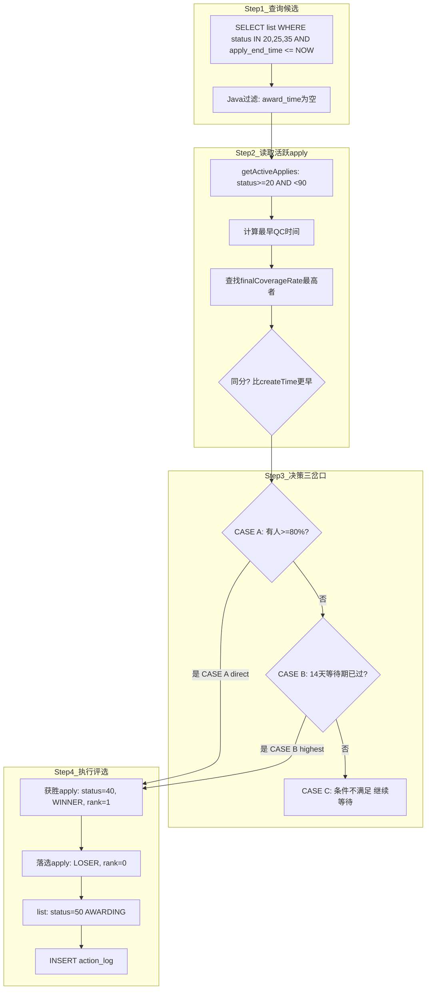

# 6-4 自动评选分配任务 - AutoAwardJob

## 一、概述

| 项目 | 说明 |
|------|------|
| **调度频率** | 每天 21:00 |
| **XXL-Job Handler** | `consignmentRecruitAutoAwardJobHandler` |
| **Service** | `ConsignmentRecruitAutoAwardService` |
| **核心逻辑** | 对已截止申请的清单，读取各寄卖商已算好的覆盖率，按PRD规则决策获胜者 |
| **重要前提** | 覆盖率数据由 CoverageCalcService（双触发）逐步写入，本Job仅做决策，不做覆盖率计算
| **触发方式** | 仅本Job定时调度（每天21:00），CeArrivalCheckJob不再触发评选，评选决策统一在此执行 |
| **操作者** | `SYSTEM_AUTO_AWARD_OPERATOR` = `system(自动评选)` |

---

## 二、数据源

| 操作 | 表/配置 | 字段 | 说明 |
|------|---------|------|------|
| **读取** | `recruit_list` | `id, list_status, apply_end_time, award_time` | 筛选可评选清单 |
| **读取** | `recruit_apply` | `supplier_id, group_id, final_coverage_rate, first_qc_pass_time, apply_status, create_time` | 各寄卖商的覆盖率数据 |
| **读取** | `CommonDictConfig` | `directAwardCoverageRate(0.80), awardWaitDays(14天)` | 评选规则配置 |
| **写入** | `recruit_apply` | `apply_status, award_result, rank_no, award_reason` | 评选结果 |
| **写入** | `recruit_list` | `list_status, award_time, award_by, award_supplier_id, award_apply_id, award_group_id` | 分配信息 |
| **写入** | `action_log` | `action=award` | 操作日志 |

---

## 三、标准决策流程



---

## 四、状态走向

```
recruit_list:
  20(招募中) / 25(已抢完) / 35(评选中) ─── CASE A/B ───→ 50(分配中)
                                           CASE C ───→ 保持原状态，下次调度重试

recruit_apply:
  20/30 ─── 获胜 ───→ 40(分配完成) + award_result=1(WINNER)
        ─── 未获胜 ───→ 状态不变 + award_result=2(LOSER)
```

---

## 五、表数据处理

| 操作 | 表 | 说明 |
|------|-----|------|
| SELECT | `recruit_list` | `WHERE list_status IN (20,25,35) AND apply_end_time <= NOW()` |
| SELECT | `recruit_apply` | 读取覆盖率和QC时间 |
| UPDATE | `recruit_apply` | 更新评选结果（获胜/未获胜） |
| UPDATE | `recruit_list` | 更新分配信息 |
| INSERT | `action_log` | `action=award` 日志 |

---

## 六、评选结果字段说明

| 字段 | 获胜者 | 未获胜者 |
|------|--------|---------|
| `apply_status` | `40(AWARD_DONE)` | 不变 |
| `award_result` | `1(WINNER)` | `2(LOSER)` |
| `rank_no` | `1` | `0` |
| `award_reason` | `"direct"` (CASE A) / `"highest"` (CASE B) | — |

---

## 七、难点与解决点

| 难点 | 解决 |
|------|------|
| **覆盖率数据是由双触发逐步写入的，评选Job不做计算** | 明确职责分离：CoverageCalcService负责覆盖率更新，AutoAwardJob仅做决策读取 |
| **同分竞争（覆盖率相同）** | 以 `apply.getCreateTime()` 更早者获胜（申请加入招募车最早），注意不是 `firstQcPassTime` |
| **CASE C清单何时评选？** | 本Job不处理，下次调度（次日21:00）重试。评选仅由此Job负责，CeArrivalCheckJob不再触发评选 |
| **评选事务一致性** | `@Transactional`：获胜apply更新 + 其余apply更新 + list更新在同一事务内 |
| **已评选过的清单不重复处理** | 查询条件 `award_time IS NULL` + Java 过滤 |
| **查询条件包含35(EVALUATING)** | `list_status IN (20,25,35)` — 35状态的清单也已进入评选阶段 |

---

## 八、上游依赖与防故障策略

> **依赖链路**: AutoGroupJob(INSERT) → AutoPublishJob(UPDATE) → EvalStartJob(35) → **AutoAwardJob(读取20/25/35)**
> **参考**: [6-0-任务间依赖与防故障策略.md](6-0-任务间依赖与防故障策略.md)

| 措施 | 说明 |
|------|------|
| **枚举常量查询** | `list_status IN (RECRUITING, FULL_SNAPPED, EVALUATING)` 使用枚举类 |
| **award_time判空** | Java 过滤 `award_time IS NULL` 避免重复评选 |
| **空数据容忍** | 无可评选清单时记录INFO日志正常结束 |
| **事务隔离** | 评选过程在 `@Transactional` 内 |
