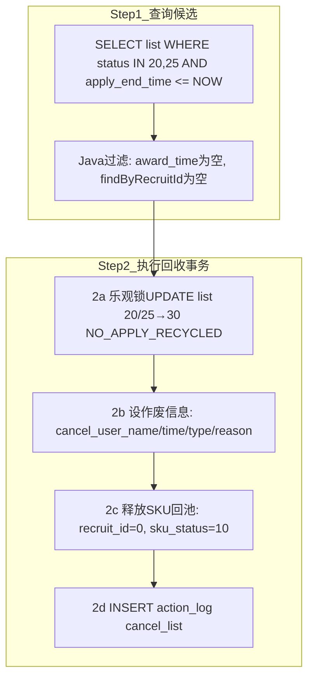

# 6-7 无人清单作废任务 - NoApplyCleanJob

## 一、概述

| 项目 | 说明 |
|------|------|
| **调度频率** | 每天 21:15 |
| **XXL-Job Handler** | `consignmentRecruitNoApplyCleanJobHandler` |
| **Service** | `ConsignmentRecruitNoApplyCleanService` |
| **核心逻辑** | 21:00申请截止后，清理已发布但无人申请的清单，释放SKU回招募池 |
| **操作者** | `SYSTEM_NO_APPLY_CLEAN_OPERATOR` = `system(无人清单清理)` |

---

## 二、数据源

| 操作 | 表 | 字段 | 说明 |
|------|-----|------|------|
| **读取** | `recruit_list` | `id, list_status, apply_end_time` | 筛选已截止无人申请的清单 |
| **读取** | `recruit_apply` | `recruit_id` | 判断是否有申请记录 |
| **更新** | `recruit_list` | `list_status=30, cancel_type, cancel_time, cancel_user_name` | 无人申请回收 |
| **更新** | `recruit_list_sku` | `recruit_id=0, recruit_no=null, sku_status=10(待组单)` | SKU释放回招募池 |
| **写入** | `action_log` | `action=cancel_list` | 操作日志 |

---

## 三、标准流程



---

## 四、状态走向

```
recruit_list:
  20(招募中) ── 无人申请 ──→ 30(无人申请已回收)
  25(已抢完) ── 无人申请 ──→ 30(无人申请已回收)
    （25已抢完不可能无人申请，理论不会进入此分支，但作为防御性检查保留）
  35(评选中) ── 不会被此Job处理 ──→ 保持不变

recruit_list_sku:
  30(已发布) ──→ 10(待组单/PENDING_GROUP) [recruit_id=0, 回到招募池]
```

---

## 五、表数据处理

| 操作 | 表 | 说明 |
|------|-----|----------|
| SELECT | `recruit_list` | `WHERE list_status IN (20,25) AND apply_end_time <= NOW()` |
| SELECT | `recruit_apply` | `findByRecruitId(id)` 判断是否有申请 |
| UPDATE | `recruit_list` | `list_status=30, cancel_type='auto_no_apply', cancel_reason='无人申请'` |
| UPDATE | `recruit_list_sku` | `recruit_id=0, recruit_no=null, sku_status=10(PENDING_GROUP)` |
| INSERT | `action_log` | `action=cancel_list` |

---

## 六、难点与解决点

| 难点 | 解决 |
|------|------|
| **21:15执行时，21:00刚截止，可能有寄卖商在21:00~21:15之间申请** | Java 过滤 `applyRepository.findByRecruitId()` 为空，有人申请则不回收 |
| **与AutoAwardJob的时序关系** | 21:00 AutoAwardJob先执行评选 → 21:15 NoApplyCleanJob再清理无人申请的 |
| **不包含35(评选中)** | 35状态的清单必然有申请者（否则不会进入评选），无需处理 |
| **SKU释放幂等** | `sku_status=10(PENDING_GROUP)` + `recruit_id=0`，不依赖原始sku_status条件 |

---

## 七、上游依赖与防故障策略

> **依赖链路**: AutoGroupJob(INSERT) → AutoPublishJob(UPDATE list_status=20/25) → **NoApplyCleanJob(读取list_status+释放SKU)**
> **参考**: [6-0-任务间依赖与防故障策略.md](6-0-任务间依赖与防故障策略.md)

### 7.1 反向影响分析

NoApplyCleanJob **不仅依赖上游数据，还会反向影响 AutoGroupJob**：
- NoApplyCleanJob 释放的 SKU (`recruit_id=0, sku_status=10`) 会回到招募池
- AutoGroupJob 下次执行时会重新读取这些 SKU，再次组单

### 7.2 防护措施

| 措施 | 说明 |
|------|------|
| **乐观锁UPDATE** | `batchUpdateStatus(id, oldStatus, 30)` 确保只操作正确状态的清单 |
| **SKU释放幂等** | `recruit_id=0, sku_status=10` 幂等安全 |
| **枚举常量** | 所有状态值使用枚举类，不硬编码 |
| **空数据容忍** | 无人申请清单不存在时正常结束 |
