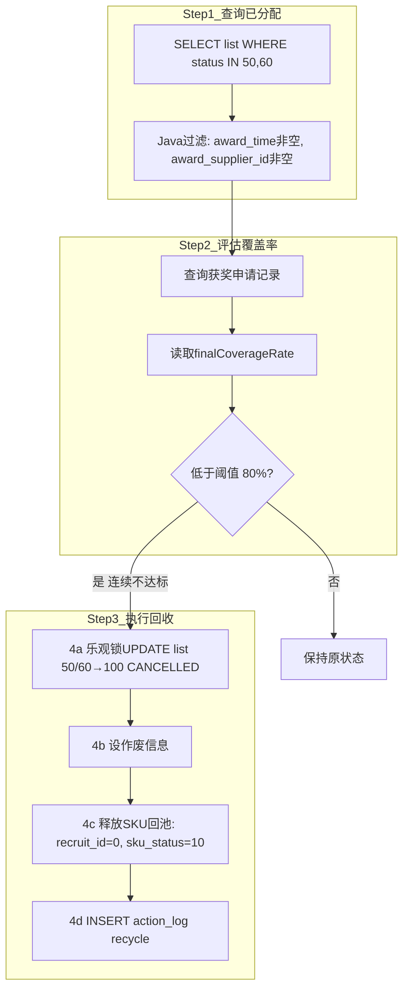

# 6-8 清单回收检查任务 - RecycleCheckJob

## 一、概述

| 项目 | 说明 |
|------|------|
| **调度频率** | 每月1日 凌晨 4:00 |
| **XXL-Job Handler** | `consignmentRecruitRecycleCheckJobHandler` |
| **Service** | `ConsignmentRecruitRecycleCheckService` |
| **核心逻辑** | 检查已分配的清单，评估获胜寄卖商的持续覆盖率，连续不达标则回收清单 |
| **操作者** | `SYSTEM_RECYCLE_OPERATOR` = `system(清单回收)` |

---

## 二、数据源

| 操作 | 表/配置 | 字段 | 说明 |
|------|---------|------|------|
| **读取** | `recruit_list` | `id, list_status, award_time, award_supplier_id, award_apply_id` | 筛选已分配清单 |
| **读取** | `recruit_apply` | `final_coverage_rate, update_time` | 获奖申请的覆盖率数据 |
| **读取** | `CommonDictConfig` | `recycleCoverageThreshold(0.80)` | 回收覆盖率阈值 |
| **更新** | `recruit_list` | `list_status=100(作废), cancel_type, cancel_time, cancel_user_name` | 回收清单 |
| **更新** | `recruit_list_sku` | `recruit_id=0, recruit_no=null, sku_status=10(待组单)` | SKU释放回池 |
| **写入** | `action_log` | `action=recycle` | 操作日志 |

---

## 三、标准流程



---

## 四、状态走向

```
recruit_list:
  50(分配中) / 60(清单完成) ── 连续不达标 ──→ 100(作废/CANCELLED)
                                ── 达标 ──→ 状态不变

recruit_list_sku:
  30(已发布) ──→ 10(待组单/PENDING_GROUP) [recruit_id=0, 回招募池]
```

---

## 五、覆盖率评估方法（evaluateCoverage）

```java
CoverageEvalResult evaluateCoverage(ConsignmentRecruitListPO list):
    │
    ├─ 查询获奖申请 (award_apply_id)
    ├─ 读取 finalCoverageRate
    ├─ 构建月度覆盖率列表（当前月份数据点）
    │    month = apply.updateTime 的 yyyy-MM
    │    coverageRate = finalCoverageRate
    │
    └─ 判断当前月份是否低于阈值
       threshold = recycleCoverageThreshold * 100
       finalRate < threshold → consecutiveMonthsBelowThreshold = 1
       finalRate >= threshold → consecutiveMonthsBelowThreshold = 0

    ⚠️ TODO: 跨模块查询供应商历史月度覆盖率
    待实现后：
      查询最近N个月的月度覆盖率数据
      逐月判断是否达标
      计算连续不达标月数
      连续2个月 < 80% → 预警
      连续3个月 < 80% → 回收
```

**CoverageEvalResult 结构**：

| 字段 | 类型 | 说明 |
|------|------|------|
| `listId` | Long | 清单ID |
| `supplierId` | Long | 供应商ID |
| `consecutiveMonthsBelowThreshold` | int | 连续不达标月数 |
| `monthlyCoverageList` | List | 月度覆盖率列表 |

---

## 六、表数据处理

| 操作 | 表 | 说明 |
|------|-----|----------|
| SELECT | `recruit_list` | `WHERE list_status IN (50,60)` |
| SELECT | `recruit_apply` | 查询获奖申请的覆盖率 |
| UPDATE | `recruit_list` | `list_status=100, cancel_type='auto_recycle'` |
| UPDATE | `recruit_list_sku` | `recruit_id=0, sku_status=10(PENDING_GROUP)` |
| INSERT | `action_log` | `action=recycle` |

---

## 七、难点与解决点

| 难点 | 解决 |
|------|------|
| **月度覆盖率数据不在本系统** | 当前基于获奖申请的 `finalCoverageRate` 做单月评估；待实现跨模块查询 |
| **"连续N个月"的判断逻辑** | 当前为TODO状态，待跨模块/跨表查询实现后完善 |
| **SKU回池后清单状态同步** | 回收后SKU `recruit_id=0, sku_status=10`，下次组单时可被重新组入 |
| **乐观锁** | `batchUpdateStatus(id, oldStatus, 100)` 保障只回收正确状态的清单 |
| **空数据容忍** | 无可回收清单时正常结束 |

---

## 八、上游依赖说明

> **依赖链路**: AutoGroupJob → AutoPublishJob → AutoAwardJob → **RecycleCheckJob**
> **依赖强度**: 极低（仅读取 `recruit_list.list_status=50/60`，这些都是我们自己的任务设置的）
> **参考**: [6-0-任务间依赖与防故障策略.md](6-0-任务间依赖与防故障策略.md)

| 措施 | 说明 |
|------|------|
| **乐观锁UPDATE** | `batchUpdateStatus(id, oldStatus, 100)` 保障只回收正确状态的清单 |
| **SKU释放幂等** | `recruit_id=0, sku_status=10` 幂等安全 |
| **空数据容忍** | 无可回收清单时正常结束 |
