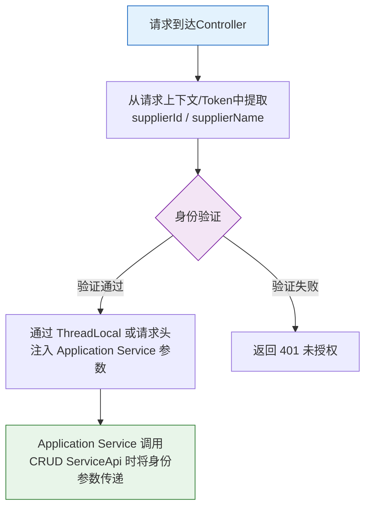

# 7-2 寄卖商工作台 Controller

## 一、概述

- **PRD章节**: 2.1.4 供应商工作台（寄卖商）
- **面向用户**: 寄卖商供应商（登录供应商工作台）
- **功能说明**: 提供招募市场列表查看、招募车管理（加入/撤回/移除/查询）、同源寄卖商查询、覆盖率详情查看等前端 Controller 层接口定义
- **所属模块**: `pa-scms-application` → `pa-scms-application-biz`
- **Controller 包路径**: `com.ux168.pa.application.scms.biz.apiimpl.consignment.recruit.supplier`
- **Application Service 包路径**: `com.ux168.pa.application.scms.biz.service.consignment.recruit`

## 二、接口清单

所有接口归属于 `ConsignmentRecruitSupplierController`，基路径为 `/api/scms/consignment/recruit/supplier`。
所有 POST 请求使用 `@RequestBody` JSON Body 传参，DTO 均为 `ConsignmentRecruitSupplierService` 内部静态类。

| 接口 | 方法 | URL | 请求DTO | 响应DTO |
|------|------|-----|---------|---------|
| 市场头部统计 | POST | `/v1/market/stat` | `MarketStatReqDTO` | `MarketHeaderStatRespDTO` |
| 招募市场列表分页 | POST | `/v1/market/page` | `MarketPageReqDTO` | `MarketPageRespDTO` |
| 招募市场SKU列表 | POST | `/v1/market/skuList` | `SkuListReqDTO` | `List<ConsignmentRecruitListSkuRespDTO>` |
| 加入招募车 | POST | `/v1/cart/join` | `CartJoinReqDTO` | `ValueDTO<Long>` |
| 撤回招募车 | POST | `/v1/cart/withdraw` | `CartWithdrawReqDTO` | `ValueDTO<Boolean>` |
| 招募车列表分页 | POST | `/v1/cart/page` | `CartPageReqDTO` | `CartPageRespDTO` |
| 招募结果详情 | POST | `/v1/cart/awardDetail` | `AwardDetailReqDTO` | `AwardDetailRespDTO` |
| CE单追加SKU | POST | `/v1/cart/appendSku` | `AppendSkuReqDTO` | `ValueDTO<Boolean>` |
| 覆盖率详情 | GET | `/v1/coverage/detail` | Query: applyId | `ConsignmentRecruitApplyRespDTO` |
| 同源供应商列表 | POST | `/v1/sameSource/list` | `SameSourceListReqDTO` | `List<ConsignmentRecruitApplyRespDTO>` |

> ⚠ **说明**：`/v1/cart/remove` 已删除，撤回/移除统一使用 `/v1/cart/withdraw`。

## 三、业务关联

### 3.1 与子功能文件的映射

| 接口 | 关联功能文件 | 说明 |
|------|------------|------|
| `/market/page` | [5-1-招募市场列表.md](../5-寄卖商工作台业务/5-1-招募市场列表.md) | 市场列表+特殊排序+操作按钮 |
| `/market/stat` | [5-1-招募市场列表.md](../5-寄卖商工作台业务/5-1-招募市场列表.md) | 头部统计卡片 |
| `/cart/join` | [5-2-招募车管理.md](../5-寄卖商工作台业务/5-2-招募车管理.md) | 加入购物车 |
| `/cart/withdraw` | [5-2-招募车管理.md](../5-寄卖商工作台业务/5-2-招募车管理.md) | 撤回申请 |
| `/cart/page` | [5-2-招募车管理.md](../5-寄卖商工作台业务/5-2-招募车管理.md) | 列表查询 |
| `/cart/count` | [5-2-招募车管理.md](../5-寄卖商工作台业务/5-2-招募车管理.md) | 数量统计 |
| `/cart/remove` | [5-2-招募车管理.md](../5-寄卖商工作台业务/5-2-招募车管理.md) | 移除SKU |
| `/cart/awardDetail` | [5-2-招募车管理.md](../5-寄卖商工作台业务/5-2-招募车管理.md) | 招募结果弹窗 |
| `/cart/appendSku` | [5-3-CE操作与覆盖率.md](../5-寄卖商工作台业务/5-3-CE操作与覆盖率.md) | CE单追加SKU |
| `/same-source` | [5-2-招募车管理.md](../5-寄卖商工作台业务/5-2-招募车管理.md) | 同源查询 |
| `/coverage-detail` | [5-3-CE操作与覆盖率.md](../5-寄卖商工作台业务/5-3-CE操作与覆盖率.md) | 覆盖率详情 |

### 3.1 Admin寄卖商工作台 Controller (ConsignmentRecruitAdminSupplierController)

**PRD 2.1.5** Admin版与普通寄卖商版区别：
- 2.1.5.1 招募清单列表 → 有"下载招募清单"按钮，无"加入招募车"
- 2.1.5.2 招募车管理 → 只读查看，无操作按钮

**基路径**: `/api/scms/consignment/recruit/admin-supplier`
**注**: 所有 POST 请求使用 `@RequestBody` JSON Body 传参，DTO 复用 SupplierService 内部定义。

| 接口 | 方法 | URL | 请求DTO | 响应DTO | 说明 |
|------|------|-----|---------|---------|------|
| 市场头部统计 | POST | `/v1/market/stat` | `MarketStatReqDTO` | `MarketHeaderStatRespDTO` | Admin只读 |
| 市场列表分页 | POST | `/v1/market/page` | `MarketPageReqDTO` | `MarketPageRespDTO` | Admin只读 |
| 市场SKU列表 | POST | `/v1/market/skuList` | `SkuListReqDTO` | `List<ConsignmentRecruitListSkuRespDTO>` | Admin只读 |
| 招募车列表分页 | POST | `/v1/cart/page` | `CartPageReqDTO` | `CartPageRespDTO` | Admin只读 |
| 招募结果详情 | POST | `/v1/cart/awardDetail` | `AwardDetailReqDTO` | `AwardDetailRespDTO` | Admin只读 |
| 覆盖率详情 | GET | `/v1/coverage/detail` | Query: applyId | `ConsignmentRecruitApplyRespDTO` | Admin只读 |
| 同源供应商列表 | POST | `/v1/sameSource/list` | `SameSourceListReqDTO` | `List<ConsignmentRecruitApplyRespDTO>` | Admin只读 |

### 3.3 用户身份获取

#### 身份验证流程



寄卖商工作台需要获取当前登录供应商的身份信息：

```
1. 请求到达Controller
2. 从请求上下文/Token中提取 supplierId / supplierName
3. 通过 ThreadLocal 或请求头注入 Application Service 的参数中
4. Application Service 调用 CRUD ServiceApi 时将身份参数传递
```

## 四、Controller 标准流程

### 4.1 市场列表查询

```
@PostMapping("/market/page")
public Result<PageResult<RecruitMarketRespDTO>> pageQueryMarket(
        @Valid @RequestBody RecruitMarketQueryDTO queryDTO) {
    // 1. 参数校验
    // 2. 注入当前供应商身份 (supplierId)
    // 3. 调用Application Service
    PageResult<RecruitMarketRespDTO> result = supplierService.pageQueryMarket(queryDTO);
    // 4. 返回Result包装
}
```

### 4.2 加入招募车（并发敏感）

```
@PostMapping("/cart/join")
public Result<Void> joinCart(@Valid @RequestBody JoinCartDTO joinDTO) {
    // 1. 参数校验 (skuId, optionType)
    // 2. 注入当前供应商身份
    // 3. 调用Application Service
    supplierService.joinCart(joinDTO);
    //       ↓ Service内部使用悲观锁/乐观锁处理并发
    // 4. 返回Result.success()
}
```

### 4.3 覆盖率详情查询

```
@PostMapping("/coverage-detail")
public Result<CoverageDetailRespDTO> getCoverageDetail(
        @Valid @RequestBody CoverageDetailQueryDTO queryDTO) {
    // 1. 参数校验 (skuId/listId)
    // 2. 注入当前供应商身份
    // 3. 调用Application Service
    CoverageDetailRespDTO result = supplierService.getCoverageDetail(queryDTO);
    // 4. 返回覆盖率数据（含CE/Open/Inbound/QC分阶段覆盖率）
}
```

## 五、代码位置

```
pa-biz-application/pa-scms-application/pa-scms-application-biz/src/main/java/com/ux168/pa/application/scms/biz/
├── apiimpl/consignment/recruit/
│   └── supplier/
│       └── ConsignmentRecruitSupplierController.java  ← 寄卖商工作台Controller
└── service/consignment/recruit/
    └── ConsignmentRecruitSupplierService.java
```

## 六、难点与解决点

| 难点 | 解决方案 |
|------|---------|
| 供应商身份注入 | 在Controller层使用 `@RequestHeader` 或 Spring MVC 拦截器从Token中解析 `supplierId`，通过 `BaseContextHolder` 传递给 Application Service |
| 招募市场特殊排序规则（周三14-21点同源优先） | 排序逻辑在 Application Service 中实现，Controller仅透传查询参数 |
| 并发加入招募车 | Application Service 使用 `SELECT ... FOR UPDATE` 悲观锁或乐观锁（version字段）防超卖，Controller层无感知 |
| 覆盖率详情的多阶段数据聚合 | 覆盖率计算在 Application Service 中完成，Controller仅展示结果

---

## 七、CRUD API 依赖

当前Controller注入 Application Service（`ConsignmentRecruitSupplierService`），由 Service 内部调用 CRUD ServiceApi：

| 业务功能 | 依赖的 CRUD ServiceApi | API 文档 |
|---------|----------------------|---------|
| 招募市场列表 | `ConsignmentRecruitListServiceApi`（查询）+ `ConsignmentRecruitApplyServiceApi`（统计） | [8-CRUD第11章](../8-CRUD数据操作层技术方案.md#十一开放-api-接口serviceapi) |
| 招募车管理 | `ConsignmentRecruitApplyServiceApi`（加入/撤回/移除） | 同上 |
| CE操作 | `ConsignmentRecruitApplyServiceApi`（CE状态更新） | 同上 |
| 覆盖率 | `ConsignmentRecruitApplyServiceApi`（覆盖率字段更新） | 同上 |
| 操作日志 | `ConsignmentActionLogServiceApi` | 同上 |

> 所有 CRUD ServiceApi 定义为 `@FeignClient(name=..., contextId=..., path=..., url = FeignConstants.DELEGATE_CONFIG)`
