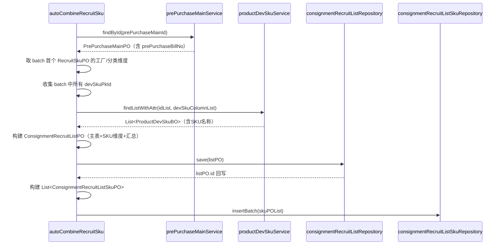

# autoCombineRecruitSku 数据来源与字段映射

## 1. 总体流程

## 2. 数据来源总览

| 序号 | 数据来源 | 类型 | 提供字段数 | 用途 |
|:---|:---|:---|:---|:---|
| 1 | PrePurchaseMainPO（scms\_pre\_purchase\_main） | PO | 2 | 预采购清单主表，提供 recruitNo、remark 等清单级数据 |
| 2 | RecruitSkuPO（scms\_recruit\_sku） | PO | 12 | 工厂/分类/SKU业务数据（SKU维度与汇总计算） |
| 3 | ProductDevSkuBO（ppms\_product\_dev\_sku） | BO | 2 | 补充SKU名称（outsideTitle / insideTitle） |

## 3. 字段级映射

### 3.1 PrePurchaseMainPO + RecruitSkuPO → ConsignmentRecruitListPO（招募清单主表）

#### PrePurchaseMainPO 提供

| 源字段 | 源类型 | 处理逻辑 | 目标字段 | 目标类型 |
|:---|:---|:---|:---|:---|
| prePurchaseBillNo | String | 直接赋值 | recruitNo | String |
| remark | String | 直接赋值 | remark | String |

#### RecruitSkuPO（取本批次首个SKU）提供

| 源字段 | 源类型 | 处理逻辑 | 目标字段 | 目标类型 |
|:---|:---|:---|:---|:---|
| paFactoryId | Long | 三目：paFactoryId != null ? paFactoryId : factoryId.longValue() | factoryId | Long |
| factoryId | Integer | （仅当 paFactoryId 为 null 时作为回退） | — | — |
| factoryFullName | String | 直接赋值 | factoryName | String |
| categoryId | Integer | categoryId != null ? categoryId.longValue() : null | categoryId | Long |
| categoryFullId | String | 直接赋值 | categoryFullPathId | String |

#### 计算/常量提供

| 源数据 | 处理逻辑 | 目标字段 | 目标类型 |
|:---|:---|:---|:---|
| batch.size() | 直接赋值 | skuCount | Integer |
| cost × moq（遍历求和） | Σ(cost × moq)，每项非空才累加 | estimatedCost | BigDecimal |
| sold30（遍历求和） | Σ(sold30)，每项非空才累加 | estimatedMonthSaleQty | Integer |
| moq（遍历求平均） | Σ(moq) / moqCount，scale=2, HALF_UP | avgMoq | BigDecimal |

### 3.2 RecruitSkuPO → ConsignmentRecruitListSkuPO（招募清单SKU明细）

| 源字段 | 源类型 | 处理逻辑 | 目标字段 | 目标类型 |
|:---|:---|:---|:---|:---|
| —（回写） | — | listPO.getId() 回写 | recruitId | Long |
| —（生成） | — | 同主表 recruitNo | recruitNo | String |
| devSkuPkId | Long | 直接赋值（即 ppms_product_dev_sku.id） | skuId | Long |
| paFactoryId | Long | 三目：paFactoryId != null ? paFactoryId : factoryId.longValue() | factoryId | Long |
| factoryId | Integer | （仅当 paFactoryId 为 null 时作为回退） | — | — |
| factoryFullName | String | 直接赋值 | factoryName | String |
| purchaseLink | String | 直接赋值 | purchaseUrl | String |
| categoryId | Integer | categoryId != null ? categoryId.longValue() : null | categoryId | Long |
| cost | BigDecimal | 直接赋值 | costPrice | BigDecimal |
| moq | Integer | 直接赋值 | moq | Integer |
| sold30 | Integer | 直接赋值 | saleQty30d | Integer |

### 3.3 ProductDevSkuBO → ConsignmentRecruitListSkuPO（补充SKU名称）

| 源字段 | 源类型 | 处理逻辑 | 目标字段 | 目标类型 |
|:---|:---|:---|:---|:---|
| outsideTitle | String | defaultString(outsideTitle, insideTitle) | skuName | String |
| insideTitle | String | （当 outsideTitle 为 null/空时回退） | — | — |

**注意**：`devSkuColumnList` 必须包含 `ProductDevSkuPO::getOutsideTitle` 和 `ProductDevSkuPO::getInsideTitle`，否则这两个字段不会被 SELECT，导致 skuName 始终为空。

## 4. 常量/固定值

| 目标字段 | 值 | 枚举含义 |
|:---|:---|:---|
| listPO.listStatus | ConsignmentRecruitListStatusEnum.WAIT_PUBLISH.getCode() | WAIT\_PUBLISH（待发布） |
| listPO.listType | ConsignmentRecruitListTypeEnum.AUTO_COMBINE.getCode() | AUTO\_COMBINE（自动组单） |
| listPO.groupTime | new Date() | 组单时间 = 当前系统时间 |
| skuPO.skuStatus | ConsignmentRecruitSkuStatusEnum.GROUPED.getCode() | GROUPED（已分组） |

## 5. 关键依赖方法

| 方法 | 所属对象 | 入参 | 返回值 |
|:---|:---|:---|:---|
| findById(Long) | prePurchaseMainService | prePurchaseMainId | PrePurchaseMainPO（含 prePurchaseBillNo） |
| findListWithAttr(queryBO, columnList, isAsc) | productDevSkuService | idList=devSkuPkIds, columnList, isAsc=true | List<ProductDevSkuBO> |
| save(entity) | consignmentRecruitListRepository | ConsignmentRecruitListPO | boolean（自动回写 entity.id） |
| insertBatch(list) | consignmentRecruitListSkuRepository | List<ConsignmentRecruitListSkuPO> | void |

## 6. 未映射字段说明

以下字段在创建时未赋值（保持 null / 默认值），待后续流程（发布、报名、评标）填充：

| 表 | 字段 | 填充时机 |
|:---|:---|:---|
| recruit_list | fileUrl | 手动上传 |
| recruit_list | publishBeginTime / applyBeginTime / applyEndTime / publishEndTime | AutoPublishJob / manualPublish |
| recruit_list | publishBy / auditBy / awardBy | 发布 / 审核 / 评标 |
| recruit_list | awardSupplierId / awardGroupId / awardApplyId / awardCeBillNo | 评标完成 |
| recruit_list | cancelUserName / cancelTime / cancelType / cancelReason | 作废 |
| recruit_list | estimatedMonthSaleAmount | 暂未计算（= estimatedMonthSaleQty × 平均成本） |
| recruit_list_sku | productModel / vehicleModel / unit / packageInfo / grossWeightG / packageSizeCm | 可从 ProductDevSku 自定义属性补充 |
| recruit_list_sku | sourceModel / deliveryDays / saleQty90d / replenishRemind21d | 可从 ProductDevSku 自定义属性补充 |
| recruit_list_sku | sourceType / importBatchNo / importUser / importTime / failReason | 后续导入/处理时填充 |
