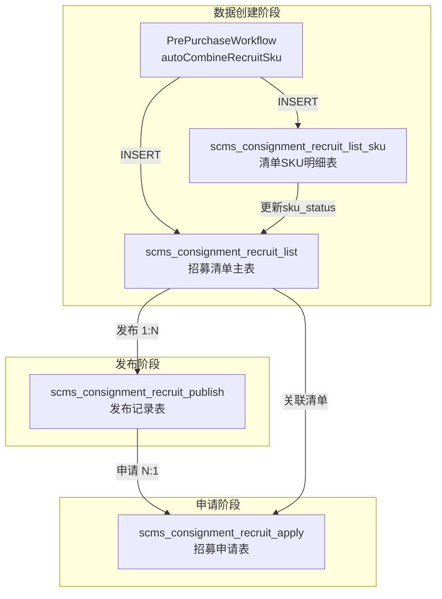

# 招募模块 - 4 表数据交互关系

## 一、4 表关系总览



**关联键总览：**

| 源表 | 关联键 | 目标表 | 关系 |
|------|--------|--------|------|
| `recruit_list` | `id` → `recruit_list_sku.recruit_id` | `recruit_list_sku` | 1:N |
| `recruit_list` | `id` → `recruit_publish.recruit_id` | `recruit_publish` | 1:N（同一清单只有一个有效轮次） |
| `recruit_publish` | `id` → `recruit_apply.recruit_public_id` | `recruit_apply` | 1:N |
| `recruit_list` | `id` → `recruit_apply.recruit_id` | `recruit_apply` | 1:N（每个寄卖商对每个清单仅一条有效） |

---

## 二、逐表说明

### 2.1 `scms_consignment_recruit_list` - 招募清单主表

| 属性 | 说明 |
|------|------|
| **创建时机** | `PrePurchaseWorkflowServiceImpl.autoCombineRecruitSku()` 预采购审核通过后自动生成 |
| **主键** | `id` |
| **核心字段** | `recruit_no`(SC单号)、`factory_id/name`、`category_id`、`sku_count`、`estimated_cost`、`list_status`、`list_type` |
| **状态流转** | `10(待发布)` → `20(招募中)` → `25(已抢完)` → `50(分配中)` → `60(清单完成)` / `100(作废)` |
| **关联** | 1:N → `recruit_list_sku` (通过 `id` → `recruit_id`) |
| **关联** | 1:N → `recruit_publish` (通过 `id` → `recruit_id`)，有且仅有一个最新有效轮次 |

### 2.2 `scms_consignment_recruit_list_sku` - 清单SKU明细表

| 属性 | 说明 |
|------|------|
| **创建时机** | 与 `recruit_list` 同时创建 |
| **角色** | `recruit_id > 0`: 属于某清单的SKU明细；`recruit_id = 0`: 在招募池中未组单 |
| **核心字段** | `recruit_id`、`sku_id`、`sku_name`、`category_id`、`factory_id/name`、`moq`、`cost_price`、`sku_status` |
| **状态流转** | `10(待组单/在池中)` → `20(已组单)` → `30(已发布)` → `100(已删除)` |
| **唯一约束** | `uniq_recruit_sku`: `(recruit_id, sku_id, is_deleted)` |

### 2.3 `scms_consignment_recruit_publish` - 发布记录表

| 属性 | 说明 |
|------|------|
| **创建时机** | `ConsignmentRecruitAutoPublishService.publishList()` 定时任务 / `ConsignmentRecruitListBizService.publishSingleRecruitList()` 手动发布 |
| **核心字段** | `recruit_id`(关联清单)、`recruit_no`、`publish_round`(发布轮次)、`publish_status`、时间节点字段 |
| **时间节点** | `publish_begin_time`、`apply_begin_time`(14:00)、`apply_end_time`(21:00)、`publish_end_time`(23:59) |
| **同一清单多轮次** | 如果发第二轮，第一轮作废，同一清单有且只有一个有效轮次 |
| **关联** | `id` 被 `recruit_apply.recruit_public_id` 引用 |

### 2.4 `scms_consignment_recruit_apply` - 招募申请表

| 属性 | 说明 |
|------|------|
| **创建时机** | `ConsignmentRecruitSupplierBizServiceImpl.joinCart()` 寄卖商加入招募车 |
| **核心字段** | `recruit_id`(关联清单)、`recruit_public_id`(关联发布轮次)、`supplier_id/name`、`group_id`、`factory_id`、`apply_status`、`same_source_flag` |
| **状态流转** | `10(已加入)` → `20(已开CE)` → `30(等待评选)` → `40(分配完成)` → `50(清单完成)` / `90(超时清出)` / `100(放弃/作废)` |
| **关键约束** | 一个招募清单对一个寄卖商只能有一条有效申请记录 |
| **唯一约束** | `uniq_apply_recruit_supplier`: `(recruit_id, supplier_id, is_deleted)` |

---

## 三、数据流转时序

```
Step 1 ──── 预采购审核通过后 ────→ autoCombineRecruitSku()
                                       │
                                       ├── INSERT scms_consignment_recruit_list       (list_status=10)
                                       └── INSERT scms_consignment_recruit_list_sku    (sku_status=20)

Step 2 ──── 定时/手动发布 ──────→ AutoPublishJob / manualPublish()
                                       │
                                       ├── INSERT scms_consignment_recruit_publish     (publish_status=20)
                                       ├── UPDATE scms_consignment_recruit_list         (list_status=20, 时间字段)
                                       └── UPDATE scms_consignment_recruit_list_sku     (sku_status=30)

Step 3 ──── 寄卖商加入招募车 ──→ joinCart()
                                       │
                                       └── INSERT scms_consignment_recruit_apply        (recruit_id + recruit_public_id)

Step 4 ──── 数据展示 ──────────→ marketStat() / recruitListPage() / cartPage()
                                       │
                                       ├── 查询 recruit_publish 获取有效发布清单
                                       ├── 关联 recruit_list 获取清单详情
                                       └── 关联 recruit_apply 获取申请状态/统计
```

---

## 四、接口数据展示分层

```
寄卖商看到的招募清单列表
        │
        ├── 驱动表: recruit_publish (只展示 publish_status=20 的有效发布)
        │
        ├── 主表数据: recruit_list (清单名称、工厂、分类、时间等)
        │
        ├── SKU明细: recruit_list_sku (展开行)
        │
        ├── 竞争池: recruit_apply (按 recruit_id 统计活跃申请数)
        │
        └── 我的状态: recruit_apply (按 supplier_id + recruit_id 判断是否已加入)

寄卖商看到的招募车列表
        │
        ├── 驱动表: recruit_apply (按 supplier_id 查询)
        │
        ├── 清单数据: recruit_list (recruit_id 关联)
        │
        └── 发布数据: recruit_publish (recruit_public_id 关联)
```
